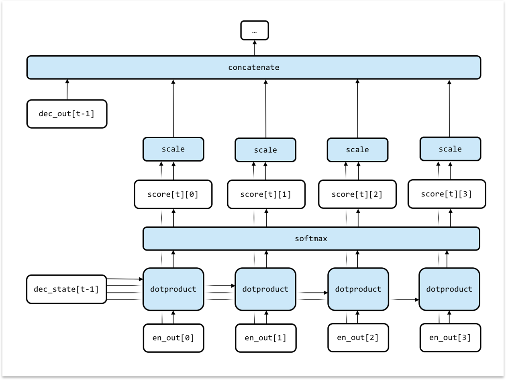

Useful when parts of input are highly correlated to correctly producing corresponding segments of output.  

Attention in decoder:

1. Create a scalar releveance score for each of encoder's outputs by dot product of previous decoder state and encoder output.
