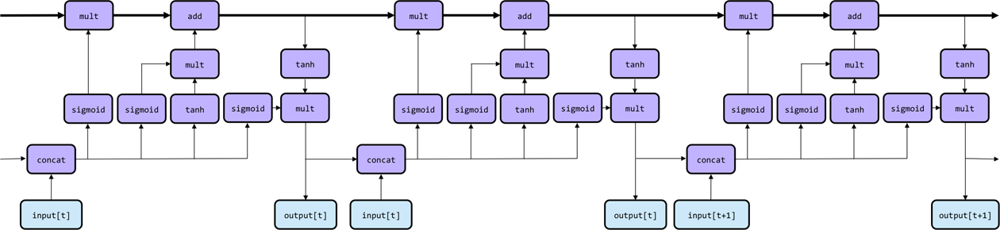

Long Short-Term Memory models
- improvement over RNN as it has Long-term memory also.

RNN's hidden state is divided into two parts:
1. Memory/Cell state: Long-term memory
2. Hidden state: short term memory
	1. The output itself is taken as hidden state.

LSTM unit architecture at tensor and operation level:  

**Memory cell:** Tensor represented by the bold inner loop above.  
- It is long-term memory.

**Keep gate:** Determines how much of previous memory to keep.  

**Write gate:** Determines how much of new input to write in memory.  
- tanh component: what information to write into the state.
- sigmoid component: further filters the informations that is to be wrote into state.

**Output gate:** Process the current time step input and memory content to create output.  

**Output:** The output of current time step. Also taken as short term memory for next time step.  

Keep gate:

Write gate:

Output gate:

Unrolled through time steps:

LSTM as stacked RNN:

----
# Applications

## seq2seq with RNN

----
# Improvement
1. [Attention Mechanism](./Attention.md)
