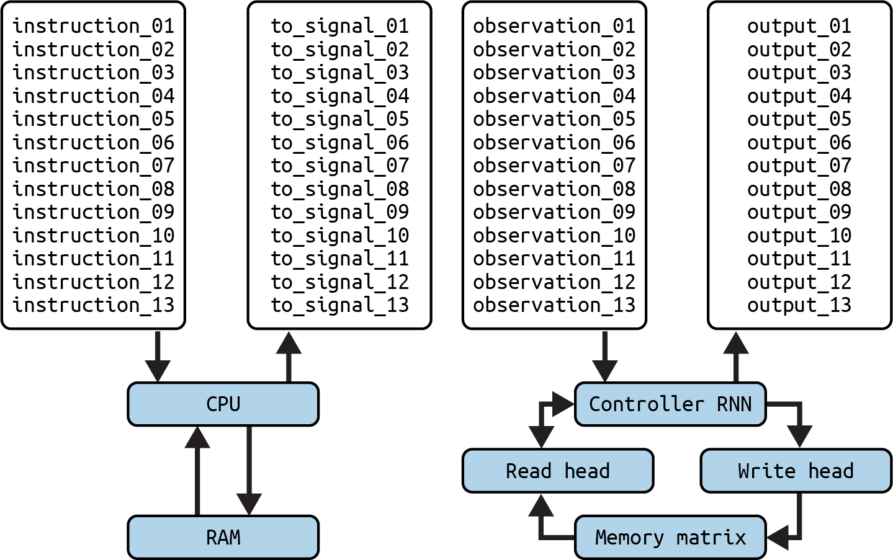
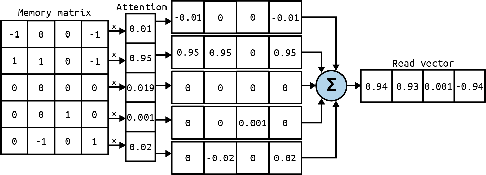
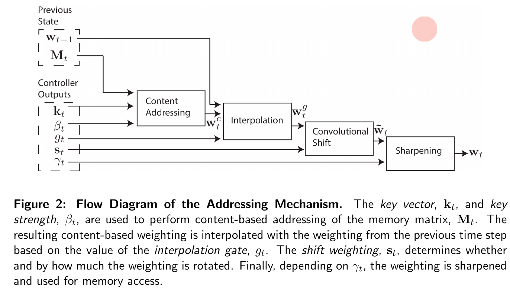
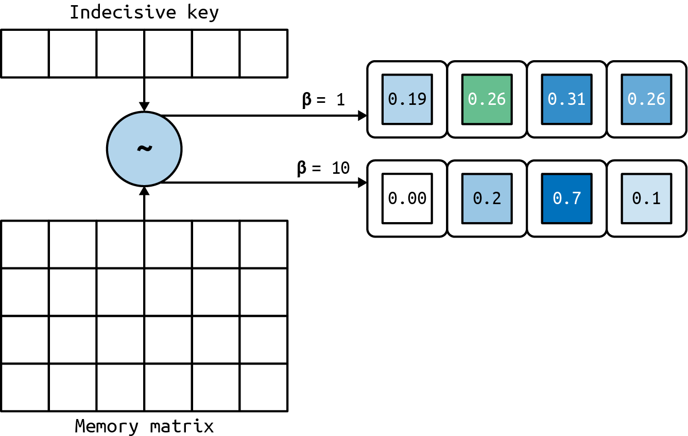
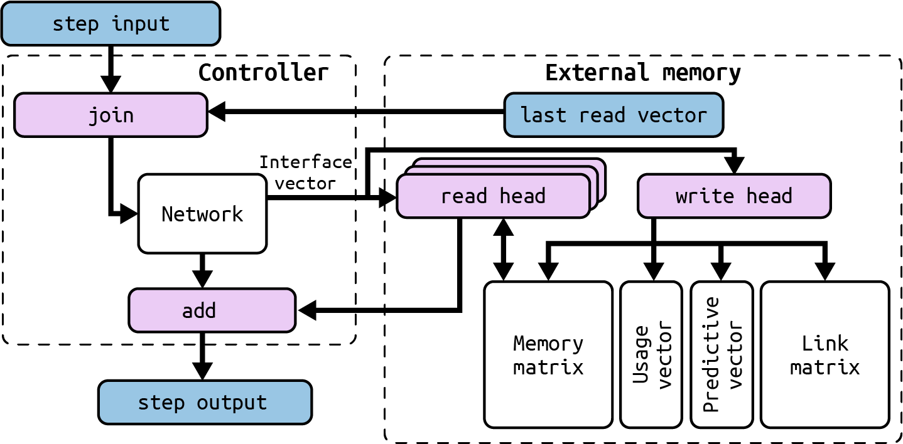
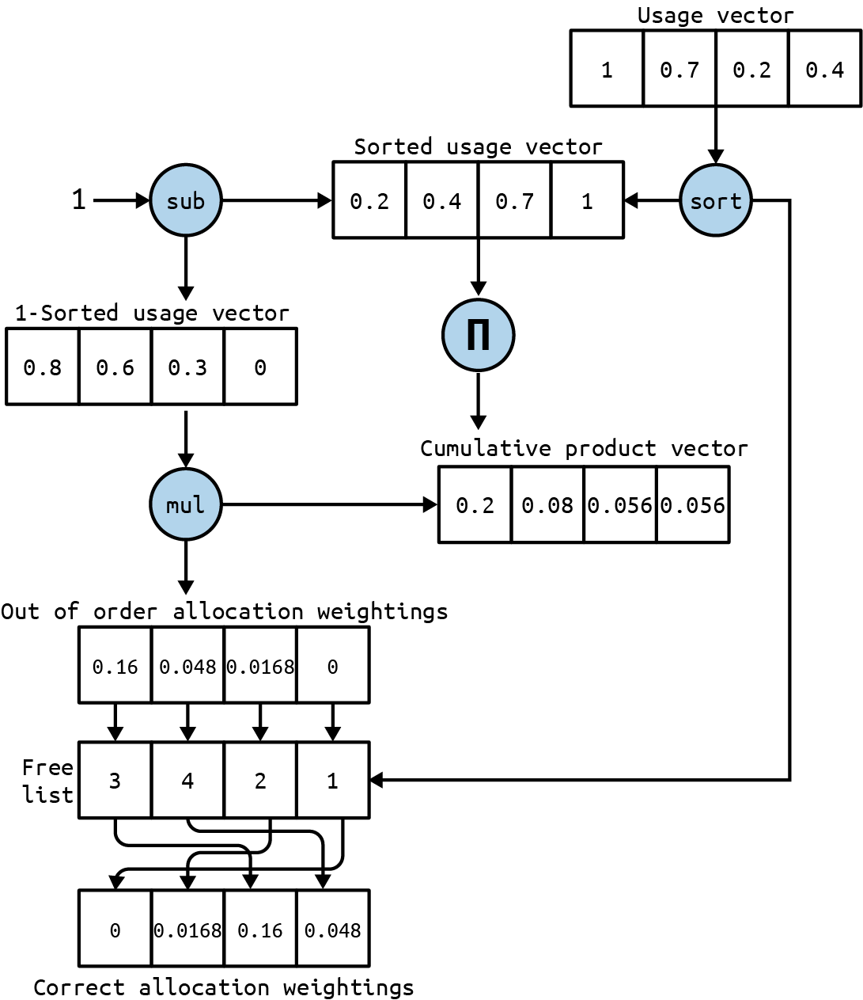
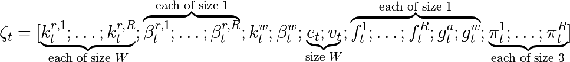

# Neural Turing Machines (NTM)
Introduced by Graves, Wayne and Danihelka from DeepMing.  

 > **Turing Complete:** Given proper configuration the model can solve any computable problem.
 
> **Working memory:** Transient system of storing and manipulation of information.

NTM tries to replicate Von-Neuman architecture of computers.

Architectural components of NTM:
1. Controller
	- CPU counterpart.
	- Controller learns its program while CPU is fed its program.
	- Usually RNNs are used.
		- Augmenting External memory to RNNs prunes large portion of its search space. RNNs are turing complete. 
1. External Memory
	- RAM counterpart.
2. Read heads
	- Memory Read Buses counterpart.
	- Can be multiple.
3. Write heads
	- Memory Write Buses counterpart.
	- Can be multiple.

NTM Architecture (comparision with modern day computer):  

> **End-to-end differentiable:** Architecture where gradients can be computed for output loss and based upon these gradients the model's parameter, that process the input, can be updated.
- NTM architecture needs to be end-to-end differentiable.
	- $\implies$ The memory(which is discrete) should be accessible in continuous manner.

## Attention Based Memory Access
- Allows to access discrete memory in continuous manner.
- Can be used in end-to-end differentiable architecture.

$N =$ Number of memory locations,  
$W =$ Size of a memory location,  
$t =$ time step,  
$M_t =$ Memory matrix of dim $(N \times W)$ at time-step $t$,  

### For read head
Generate a softmax normalized attention/weighting vector that tells how much attention to give to each location.

$w_t =$ attention vector of size $N$ for time step $t$, generated by controller,  
$r_t =$ read vector at time step $t$, of dim $W$.

$$\large r_t = M_t^Tw_t$$

How it works:  

- We look at all $N$ memory location at once.
- $w_t$(a vector) tells us how much attention to give to each location.
- We don't pin-point any location but give blurry focus to all locations.

### For write head
Generate weighting vector that tells which locations to focus erasing and writing.  

$w_t =$ weighting vector of dim $N$ with values in $[0,1]$, generated by controller,  
$e_t =$ erase vector of dim $W$, generated by controller, has values in range $[0,1]$,  
$\circ =$ element wise multiplication,  
$v_t =$ write vector of dim $W$, generated by controller,  
$E =$ matrix of ones, of dim $(N \times W)$.

$$\large M_t = \text{erase term  + write term} = M_{t-1} \circ \left( E - w_te_t^T \right) + w_tv_t^T$$

- $w_t$ component for $i'th$ memory location is small $\approx 0\implies w_te_t^T$ component is small $\implies 1-(small)$ is close to 1 $\implies$ memory content of $M_{t-1} \times 1$ approximately remains same.  
- $w_t$ is large $\rightarrow$ erase that point in first term and write on that point in second term.

----
## NTM Memory Addressing Mechanisms
- How weightings vectors are generated?
	- Some generated by controller. Others either derived from the generated weights or updated on time steps.

Types of addressing:
1. Content based addressing
2. Location based addressing

Flow diagram of the addressing mechanism:

----
### Content Based Addressing

Fetch from locations whose contents are similar to key vector generated by controller.  

$k_t =$ key vector generated by controller,  
$Sim() =$ some similarity measure,  
$\beta =$ key strength, a hyperparameter,  

$$\large \begin{aligned}
w(M[j],k,\beta) &= \text{weight of j'th location} \\ \\
&= \frac{\exp \left[ \beta Sim(M[j],k) \right]}{\sum_{i=0}^N{ \exp\left[ \beta Sim(M[i],k) \right]}}
\end{aligned}$$

- It is normalized softmax distribution over similarity scores.
- **$\beta$:** When similarity ~uniform for all memory locations, attention weights also becomes similar. $\beta$ attenuates the weight such that the difference in weights becomes significant and attention can be focused on few locations only.
	- To give intuition: for $[0.0011, 0.0059, 0.0099]$ difference in weights is small. If $\beta =100$ weights become $[0.11, 0.59, 0.99]$ the difference now increases by several decimals. Softmax is done rather than seeing direct difference.

Effect of key strength:

----
### Handling content and location based addressing

**Interpolation gating:** $g_t$ controls whether to focus on current location or the addressing given by content based lookup.  
 $g_t =$ interpolation gate, range $[0,1]$, generated by controller,  
 $w^c_t =$ Content based addressing,  
  $w_{t-1} =$ current location which actually is acess weighting from last time step,  
  $w^g_t =$ gated weighting,  
  
  $$\large w^g_t =g_tw^c_t +(1-g_t)w_{t-1}$$

- $g_t =0 \implies$ more weight to current location.
	- Helps in consecutive memory accessing.
- $g_t =1 \implies$ more weight to content based addressing.

----
### Location based addressing

**shift weighting:** Shifts the focus from one location to another using current gated weighting.
 - Helps in moving around the memory.
 - It applies convolution on the gated weighting.
- Instead of applying padding at the ends it uses rotational convolutional operator.
Let,  
$n =$ number of possible shifts around the focused location in gated weighting,  
$s_t =$ normalized softmax attention vector of size $n+1$, generated by controller
$|s_t| =$ size of $s_t$,  
$N =$ number of memory locations,  
$\tilde w_t[i]=$ weighting of $w[i]$ after shifting,  

$$\tilde w[i] = \large \sum_{j=0}^{|s_t|} w_t^g\left[\left(i+\frac{|s_t|-1}{2}-j\right) \mod N \right]s_t[j]$$

Explanation: It is 1D convolution, and has rotation instead of padding. Rotation means that when things goes off one end rotate them back to the another end.  
$s_t :$ kernel,  
$i :$ location for which we are looking shift weighting,  
$\large \sum_{j=0}^{|s_t|}w_t^g[....]s_t[j] :$ just like in convolution each element $j$ of kernel $s_t$ is getting multiplied with some element of $w_t^g$,  
$\large \frac{|s_t|-1}{2} :$ Half of $s_t$(actually $|s_t|-1$). Size of $s_t = n+1$, since $n$ is even $|s_t|-1$ is even.  
$i + \text{ above thing }:$ till upto half the length of $s_t$ from i,  
$\large i + \frac{|s_t|-1}{2} -j :$ since we are looping over $j$ from 0 to $|s_t|$. Thus, this will give us locations from ''$i- \text{half of }s_t$'' to ''$i+\text{ half of }s_t$'',  
$(\text{above thing })\mod N :$ ensures rotational convolution,  
$\large \sum_{j=0}^{|s_t|}w_t^g[...]s_t[j] :$ half length of $s_t-1$ on either side of $w[i]$ and $w[i]$ itself is of same length as $s_t$. Multiply this locations with $s_t$.  
Thus this equation is equivalent to one kernel operation to get the new shifted value for at location i. Similarly same operations is carried out for all elements of $w_t^g$.  

- $n=2 \implies$ two shifting possible: forward and backward
- $n$ should be even 
- We are able to move only forward or backward from current location.

After this operation new weightings might be blurry.  
**Sharpening operation:** Sharpens the weights.  
$\gamma_t \ge 1 =$ scalar value controlling the sharpening, generated by controller,  

$$\large w_t = \frac{\tilde w_t^{\gamma_t}}{\sum_{i=1}^N \tilde w_t[i]^{\gamma_t}}$$

where $w_t =$ our final weight vector that is used.  

----
## Limitations of NTM
1. No guarantee of interference free writing of data.
2. No way to reuse the location again.
	1. How? Why is erase vector there? No idea.
3. There is no proper temporal linking.
	1. If during writing of sequential data, the write heads jumps somewhere then it's unable to get the temporal link of the data before and after the jump.
	2.  Unable to handle sequential data properly.

----
# DNC
Proposed by Graves et. al., October 2016, DeepMind in paper *"Hybrid computing using a neural network with dynamic external memory"*.  

Differentiable Neural Computers addresses the limitations of NTM by adding data structures to the architecture.  

1. Interference free writing
	1. Usage vector: added data structure
	2. free list: computed
	3. allocation weightings: computed
2. Memory reuse
	1. Retention vector: added data structure
3. Temporal linking
	1. Precedence list: added data structure
	2. Link matrix: added data structure

----
## Overview
Almost similar to NTM.  

*controller* a neural network that interacts with external memory,  
$M=$ dim $\small N\times W$ matrix, external memory with $N$ locations and word size $W$,  
$R=$ number of read heads,  
$X=$ input vector,  

Controller takes input $X$ and $R$ read vectors from previous time step as input.  
It then produces an interface vector and pre-output vector.  
External memory takes interface vector, performs writings and reads $R$ new vectors from memory.  
Newly read vectors is sent to the controller which adds them to preoutput vector, thus producing final output $Y$.  

*interface vector* is a list of vectors and parameters generated by controller to handle all writing and reading operations,  
*preoutput vector* is simply added to the read vectors from memory,  
there are $R$ read heads but only one write head.  

DNC maintains additional data structures to overcome NTM limitations.  

DNC architecture: 

### Basic idea
NTM can overcome it's three limitations, but it doesnt give guarantee because the search space is still vast for the model to learn to overcome this limitations. Instead DNC provides additional data structures architecturally that helps overcome this limitations. This means that the controller doesnt have to learn to overcome those limitations but just need to learn to use the data structures. This decreases the search space greatly.  

----
## Similar operations to NTM
$M_t =$ Memory at time step $t$,  
$w_t^w =$ write weighting of dim $N$ for single write head, '$^w$' indicates that it is for write head,  
$w_t^{r,1}, w_t^{r,2}, ...,w_t^{r,R} =$ read weightings for $R$ read heads,  
$r_t^i =$ read vector of i'th read head,  
$v_t =$ write vector of dim $W$,  
$e_t =$ erase vector of dim $W$,  
$\circ =$ element wise multiplication,  
$E=$ matrix of dim $N\times W$ with all elements as 1,  

Memory write: 

$$\large M_t = M_{t-1} \circ (E-w_t^w e_t^T) + w_t^w v_t^T$$

Memory read:  

$$\large r_t^i = M_t^Tw_t^{r,i}$$

All these read, write, erase, etc vectos comes from interface vector.  
NTM and DNC has same mechanism for Content based addressing.  
The difference is in generation of weightings $w_t$ for both read and write heads.   

----
## Writing to memory

### Interference free writing

**Usage vector $u_t$:** a vector of size $N$, with element value in range $[0,1]$, where $0$ means that location is not being used and $1$ means that that location is being used.  
- $u_t[i]=0$ doesn't mean that i'th location wasnt used. It just means that recently there have been less reads and writes in this location.
- Initially $u_t$ is set to $0$.

**Free list $\phi$:** is indices of usage vector sorted in ascending order of usage. Thus $\phi[0]$ would contain index of the least used location.  

**Allocation weight $a_t$:** An intermediate weighting that determines which memory should be allocated for new data.  

$u_t =$ usage vector of dim $N$,  
$\phi=$ free list of dim $N$,  
$a_t =$ allocation weighting of dim $N$,  

$u_t$ is set to zeroes intitially, with usage it gets updated(using retention vector),  
$\phi_t$ is indices of $u-t$ after sorting it in ascending order of usage,  

$$\large a_t[\phi_t[j]] = (1-u_t[\phi_t[j]])\sum_{i=0}^{j-1}u_t[\phi_t[i]]$$

for $j=1,2,...,N$.  

Explanation:  
$\phi_t[j] =$ just an $u_t$ index of an element, say $z$, which is actually a location in memory,  
$u_t[\phi_t[j]]]=$ denotes the usage of location $z$,  
$a_t[\phi_t[j]]=$ allocation weight of location $z$,  
$a_t[\phi_t[j]] = (1-u_t[\phi_t[j]])$ means more the usage less the allocation weight,  
multiplying it with that summation further reduces the allocation weight for more used locations.  

Vectorized process of calculating allocation weighting:

Let,  
$c_t^w = C(M_{t-1},k_t^w,\beta_t^w)=$ lookup address from content based addressing,  
$g_t^w \in [0,1]$ is write gate,  
$g_t^w \in [0,1]$ is allocation gate,  
$w_t^w =$ final write weighting/gated write weightings,  

$$\large w_t^w = g_t^w(g_t^a a_t + (1-g_t^a)c_t^w)$$

Thus, we get the final write weighting.  
But before jumping to reading phase further data structures needs to be handled.  

### Memory reuse

**Retention vector $\psi$**: is an $N$ dimensional vector with elements in $[0,1]$ where $\psi[i]=1$ means that i'th location must be retained and $\psi[i]=0$ means that i'th location need not be retained and can be used.  

$w_{t-1}^{r,1},w_{t-1}^{r,2},...,w_{t-1}^{r,R} =$ read weightings from last time step,  
$f_t^1,f_t^2,...,f_t^R =$free gates generated by controller,  

$$\large \psi_t = \prod_{i=1}^R (1-f_t^i w_{t-1}^{r,i})$$

Explanation: More weightings $\implies$ more reads in previous time steps $\implies$ less retention, with logic that that location value is already used so maybe we dont need it again. But this is not always true, thus controller decides if we would need that data again and controls it's retention value using free gates.  

Update usage vector according to retention vector.  

$$\large u_t = (u_{t-1} + w_{t-1}^w - u_{t-1}\circ w_{t-1}^w) \circ \psi_t$$

Explanation: $(...)\circ \psi_t$ means retain only when retention value is high. Inside brackets, retain value if it's already in use $(u_{t-1})$ or has just been written to $(w_{t-1}^w)$ (to create retention vector we used read vectors not write vector). $(-u_{t-1}\circ w_{t-1}^w)$ will bring the expression in range $[0,1]$ as usage vector elements must be in that range.  
How does $(-u_{t-1}\circ w_{t-1}^w)$ scales the value to $[0,1]$?  
Minimum possible value of $u_{t-1}$ and $w_{t-1}^w$ are 0. Thus usage value can be no less than 0.  
Maximum possible value of both is 1. In this case their addition becomes 2, but $(u_{t-1}\circ w_{t-1}^w)$ is $1\times 1=1$ and overall $(2-1)=1$. Thus, the usage value can be at max 1.  
Multiplying with $\psi$ that is in range $[0,1]$ cannot increase value more than 1 or decrease less than 0.  

### Temporal linking

**Precedence vector $p_t$:** is an $N$ dimensional vector where $p_t[i]$ gives the probability that i'th location was the last location written to.  

**Link matrix $L_t$:** is a $N \times N$ dimensional matrix where $L_t[i,j]$ tells how likely location $i$ was written after location $j$.  
- $L[i,i]=0$

Initially $p_0 = [0]_{N \times 1}$.  

$$\large p_t = \left(1-\sum_{i=1}^N w_t^w[i]\right)p_{t-1} + w_t^w$$

$$\large L_t[i,j]= (1-w_t^w[i]-w_t^w[j])L_{t-1}[i,j] + w_t^w[i]p_{t-1}[j]$$

Finally we can start reading phase.  

----
## Reading from memory
Once write head has finished updating memory matrix and associated data structures, read head can now work.  

The content based addressing remains same as in NTM.  
But instead of address based where in NTM one shift left or one shift right was taking place, here shifts happen temporally. Instead of shifting left from current location, we got to the last temporally written location before this location. And instead of right shift from current location, we got to location that was likely written after current location. Thus, maintaining the temporal link.  

$c_t^{r,i}=C(M_t,k_t^{r,i}, \beta_t^{r,i}) =$ content based lookup, calculated for each read head,  
$f_t^i = L_t w_{t-1}^{r,i}=$ immediate forward weighting,  
$b_t^i = L_{t-1}^T w_{t-1}^{r,i}=$ immediate backward weighting,  

$\pi_t^i =$ read mode for i'th read head, gives weightings to backward, content based and forward lookup,  
$w_t^{r,i}=$ final read weightings for i'th read head,  

$$\large w_t^{r,i}=\pi_t^i[1] b_t^i + \pi_t^i[2] c_t^{r,i} + \pi_t^i[3]f_t^i$$

----
## Controller

**Input to controller:**  
$X_t =$ input at time step $t$,  
$r_{t-1}^1,r_{t-1}^2,...,r_{t-1}^R =$ read vectors from previous time step,  
$\chi_t =$ input to controller at time step $t$,  

$$\chi_t = [X_t;r_{t-1}^1;r_{t-1}^2;...;r_{t-1}^R]$$

$;$ represents concatenation.  
Read vectors serves similar purpose as hidden state of LSTM.  

**Outputs from controller:**  
$ζ_t =$ interface vector at time step $t$,  

$$ζ_t = [k_t^{r,1};...;k_t^{r,R}; \beta_t^{r,1};...\beta_t^{r,R};k_t^w;\beta_t^w;e_t;v_t;f_t^1;...;f_t^R;g_t^a;g_t^w;\pi_t^1;...;\pi_t^R]$$

Size of $ζ$  
$= W\times R + 1\times R + W + 1 + W + W + 1\times R + 1 + 1 + 3\times R$  
$= R\times W + 3W + 5R + 3$  

$V_t =$ pre-output vector,  
$y_t =$ final output.  

**From input to outputs:**  
$f(\chi)=$ function learned by neural network,  
$f(\chi_t)=$ output of neural network for input $\chi_t$ at time step $t$,  
$|f(\chi)|=$ size of the output of the neural network,  
$W_ζ=$ learnable parameters of dimension $(R\times W + 3W + 5R + 3)\times |f(\chi)|$,  

$$ζ_t = W_ζ f(\chi_t)$$

Before passing to memory we need to:
1. Pass $e_t,f_t^i,g_t^a,g_t^w$ through a sigmoid
2. Pass all key strengths $\beta$ through oneplus function where $oneplues(Z)=1+\log(1+e^z)$. As their value needs to be greater than 1.
3. Pass $\pi^i$ through softmax.

$Y=$ output dimension,  
$W_y =$ learnable parameters of dimension $Y\times |f(\chi)|$,  

$$V_t = W_y f(\chi_t)$$

$W_r =$ learnable parameters of dimension $(R\times W)\times Y$,  

$$y_t = V_t + [r_t^1;...;r_t^R]W_r$$

**Controller is independent of memory size.**  
Because the input and output of controller is independent of $N$. Thus, already learned controller can be scaled to larger memory without any retraining.

----
