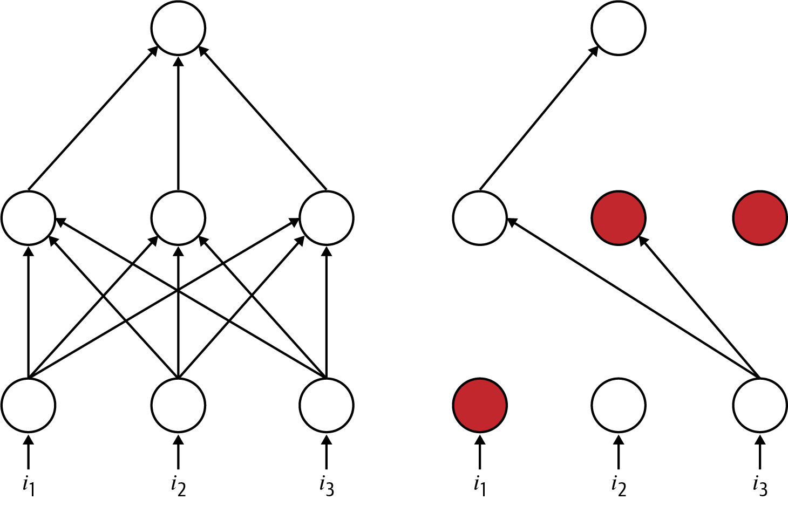

## Regularization
Add a penalizing term to the loss function that encourages the model to keep smaller/less complex weights.  

$$ \text{Minimize}\ L'(\hat y, y, \theta, \lambda) = L(\hat y, y, \theta) + \lambda f(\theta)$$

where $\lambda =$ regularization strength hyperparameter,  
$f(\theta)=$ penalizing term for weight $\theta$.  

Thus when minimizing the loss function this time the penalizing term $f(\theta)$ also needs to be minimzed. And $f(\theta)$ is constructed such that minimizing it would lead to smaller weights. Smaller weights or weights=0 leads to simpler models.  

### L1 and L2 regularization
L1 or Lasso and L2 or Ridge are well known regularizations. The penalizing term is added for evert weight $w$.  
| | L1/Lasso | L2/Ridge |
|--|--|--|
|Form: | $\lambda \sum modulus(w)$ | $\lambda \sum w^2$ |
| Nature: | Penalizes all weights equally. | Penalizes larger weights more. |
| Weights: | Tends to make weights zero. | Tends to make weights small. |
|Model: | Tends to create sparse model. | Tends to create model with smaller weights. |
| w.r.t input: | Since many weights are zero model ends up using small part of input. And also becomes robust to noise.| Since the weights are small and diffused all inputs are used with little weight given to each. 

----
## Dropout
Sets the neurons as inactive with some random probability during each minibatch of the training.  
$p=$ probability of keeping neuron active.  

The inactive neurons acts as if they dont exist for that iteration. 
Advantages:
- Prevents network from depending too much on a neuron.
- Froces the network to be accurate even in absence of information.

Dropping a neuron is equivalent to creating new architecture. Randomly dropping neurons is like sampling architectures from the sample space of architectures(not all architectures). Since we are dropping multiple neurons thus dropout is approximately combining exponentially many architectures.  

We want the output of the neuron to be similar during training and testing. But dropping neurons during training and using them during testing violates this. Thus during training time we scale the output of neurons such that the expected output of neurons during training and testing remains same. This technique is called *inverted dropout* where the outputs of non-silenced neurons are divided by $p$ before forwarding to next layer. This results the test time expectation  $E[output]= p(\frac{x}{p}) + (1-p)0 =x$, remain same $x$.

