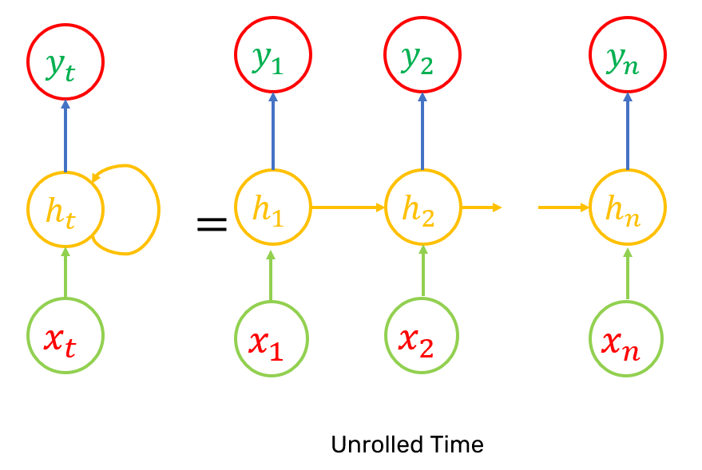
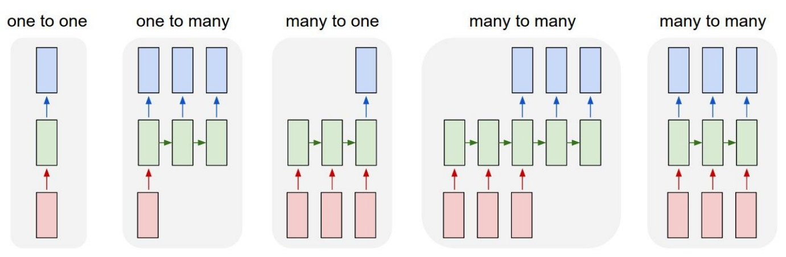

- specialized for processing sequence.
- can scale to variably long sequences.
- Uses parameter sharing temporally - if we had separate parameters for each value of time index, we couldn't generalize it to unseen time indexes.
- Alternative: Convolution across 1-D temporal sequence - but its shallow.
- RNNs can be built in many different ways. Much as almost any function can be considered to be a feedforward neural network.
- The activations of the neurons in recurrent network reprsent the accumulating state of the network instance over time.

----
# Unfolding Computational Graph

>**Computational Graph:** Way to formalize the structure of set of computations, such as those involved in mapping inputs and parameters to outputs and loss.

$t=$ time step,  
$h^{(t)} =$ hidden state at time step $t$,  
$x^{(t)} =$ input for hidden state $h^{(t)}$ at time step $t$,  
$\theta =$ parameters,
$$h^{(t)} = f(h^{(t-1)}, x^{(t)};\theta)$$
- $h^{(t)}$ acts as a kind of lossy summary.

Once the graph is unfolded finding gradients and BPTT(Back Propagation Through Time) is as usual as for FCN.
1. Only difference is that same parameters at different time steps are treated as different parameters when calculating gradients.
2. After the gradients have been computed, for a parameter  its gradients at different time steps are aggregated(mean, sum,etc).
3. The updating of parameters using gradients are as usual as with FCN.

Single neuron RNN, unrolled:  

# Vanishing gradients
#TODO

# Important Design patterns

> **Teacher Forcing:** The models where the output  $o^{(t)}$ is taken as input for $h^{(t+1)}$. Instead of $o^{(t)}$ we can provide ground truth $y^{(t)}$ during training.  
> - If no other dependencies are there then training time steps can even be parallelized.
> - Strict teacher forcing can be issue when later in open-loop mode, the test data is different from train data and we don't have the $y^{(t)}$, which makes us use $o^{(t)}$. The network is not used to taking $o^{(t)}$, which here might be off. Solution is to use mix of both during training.

----
# Improvement
1. [LSTM](./LSTM.md)
