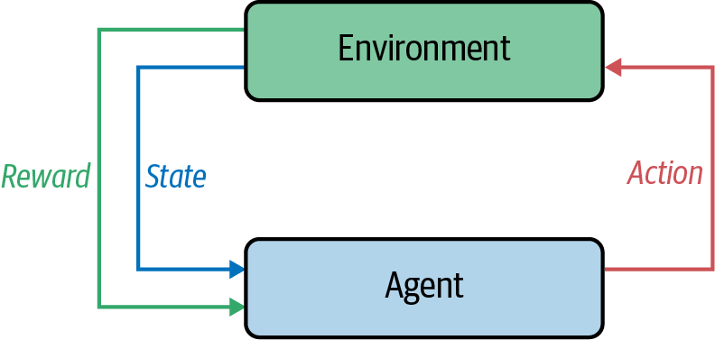
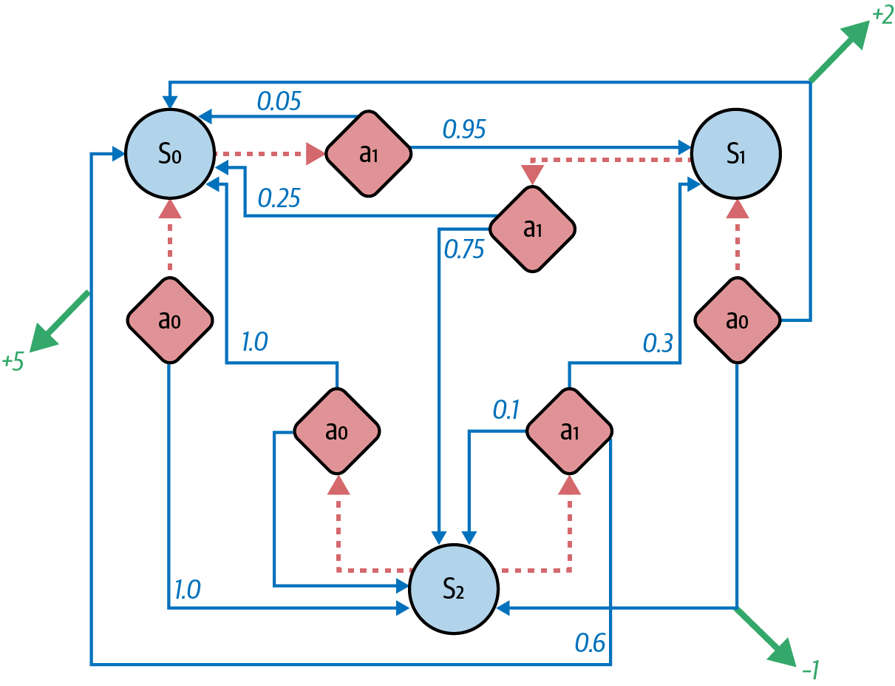

A framework where model learns via interaction and feedback.

Elements:
1. Agent
	- Performs actions.
	- Aim is to maximize the reward.
1. Environment
2. Reward

> **State:** The state of the environment.

> **Terminal state:** The final agent after which the agent cannot perform any action. Example: Game Over state.

> **State space:** The set of all states that environment can be in.

> **State transition:** When the agent performs an action the environment changes denoted by moving to next state corresponding to that action.

> **Action:** The actions that the agent can perform. This leads to transitioning to next state.

> **Action space:** The set of all possible actions that the agent can take.

> **Reward:** The signal that indicates whether the agent is performing good or bad.

> **Episode:** Series of state, action, reward tuples that runs till the agent reaches terminal state.

#### Choosing the best action
There are two ways via which an agent can choose the best action:
1. **Policy learning:** Learn a policy that maximizes the reward.
2. **Value learning:** Learn value of every state+action pair and accordingly take decision.

----
# Markov Decision Process
The RL framework can be structured as MDP. MDP offers a mathematical framework for modeling decision making in a given environmenta.  

An MDP is defined as following:
- $S=$ a finite set of possible states,
- $A=$ a finite set of actions,
- $R=$ reward
- $P(r,s'|s,a)=$ state transition function
	- Probability of performing action $a$ at state $s$ leading to state $s'$ and reward $r$.

----
# Policy
> **Policy:** How agent acts on it's current state.  
> A function $\pi$ that agent uses to choose an action, say $a$, in state $s$.

The objective of the policy is to maximize the expected future return.  

$$max_{\pi} E[R_0 + R_1 + ... + R_t | \pi]$$

## Future Return
Sometimes the best action results in negative immediate effect but a better long term result. Thus we incorporate such delayed/future rewards as future return:  

$$\large R_t = \sum_{k=0}^T r_{t+k}$$

where, 
$r_t=$ immediate reward at time $t$,  
$R_t=$ future return at time $t$,  

## Discounted future return 
But as $T \to \infty$ the $R_t$ may diverge to infinity.  

> **Discounted future return:** Strategy that gives lower weight to far future rewards than the immediate future.

$$\large\begin{aligned}
R_t &= \sum_{k=0}^T \gamma^tr_{t+k+1} \\
&= \gamma^t r_{t+1} + \gamma^t r_{t+2} +...+ \gamma^t r_{t+T+1} 
\end{aligned}$$

where, $\gamma$ is called **discount factor**.  
#TODO verify

- $R_t$ becomes finite.
- The agent becomes biased and prefers immediate future reward over far future reward.

----
# Exploration vs Exploitation

Let $\pi$ be the model's learned policy. As it is, $\pi$ is not perfect as the agent is just learning it and there might be actions taking which agent might get greater rewards.  
Now always choosing the best action according to $\pi$ is called **exploitation** of what agent already knows. This best action need not necessarily give global optimum reward, or in other words it's just local optimum.  
Now the agent can **explore** and check new actions leading to new states and rewards, but the global optimum is not easy to find thus agent might get many negative rewards in the process.  
Thus agent can either choose to exploit it's knowledge and gain reward, that is probably suboptimal, or the agent can choose to explore and search for more optimal policy, possibly gaining  immediate negative rewards but that might give better long term result.  

## $\epsilon$-Greedy
This is a technique to balance exploration vs exploitation.  

> $\epsilon=$ Probability of taking a random action at each step, without considering the agent's policy.

Thus at each step the agent takes a random action with probability $\epsilon$ and with $(1-\epsilon)$ probability takes action according to it's policy.  
This random action is akin to exploring.  

### Annealed $\epsilon$-Greedy
It is logical to take more random actions during the early phase and adhere to learned policy more during the later phase of the training.  
Thus, instead of a fixed $\epsilon$ we anneal (decrease) it overtime.

----
# Policy vs Value Learning
| | Policy Learning | Value Learning |
|--|--|--|
| Nature: | Learn policy that maximizes the reward. | Learn the value of every state+action paris. |

----
# Value learning

## Q-learning

Learns a **Q-function** that represents the quality of a state, action pair.  
**Q-value** represents expected long-term rewards.  

$$\large Q^\ast(s_t,a_t)=max_\pi E[\sum_{i=t}^T \gamma^i r^i]$$

where $Q^\ast$ is an optimal Q-function.  
#TODO verify

### Bellman Equation
Defines Q-value as function of future of Q-values.  

$$\large Q^\ast(s_t,a_t)=E[r_t + \gamma max_{a'}Q^\ast(s_{t+1},a')]$$

When an episode is over, we know the Q-value of very last action. Using this we can get last-second Q-value and so on. Thus we need many iterations before we get proper Q-value for all state-action pairs. This updating process is called *value iteration.*  

Challenges:  
1. The size of Q-table typically is computationally infeasible large.

Solution:
1. Approximate a Q-function rather than storing Q-table.

### Deep Q-Network
DQN uses deep neural network to approximate Q-function.  

DQN Q-function approximation:  

$$\large \hat Q_\theta(s,a|\theta) \sim Q^\ast(s,a)$$

where $\theta=$ parameters of the model.  

DQN future expected reward:  

$$\large R^\ast_t = (r_t + \gamma max_{a'} \hat Q(s_{t+1},a'|\theta)$$

#TODO objective function

$$\large min_\theta \sum_{e \in E}\sum_{t=0}^T\hat Q(s_t,a_t|\theta) - (r_t+\gamma max_{a'}\hat Q(s_{t+1},a'|\theta))$$

#### Learning stability

##### Update correlation problem
**Correlation update problem:** The objective function is a function of predicted Q-value of this step and predicted Q-value of next step. When parameter changes the predicted Q-value of this step as well as next step also changes. Thus loss is doubly dependent upon parameters. Further with each step, since both predicted values of this step and next step are changing, there is no proper fixed guide for our objective function as to which way to go. This introduces instability due to which the parameters may oscillate and make the loss diverge.  

**Target Q-network solution:** Instead of updating the single network frequently with respect to itself, introduce a second network *target network*. Measure the loss with respect to this target function and since parameter update doesnt have affect on target function we get stability. In a way this target function, remaining fixed, provides a temporary guide to our loss function. The target function is copy of the prediction function but with lag in parameter update. Target function parameter is updated after every few batches.

##### Experience correlation problem
**Problem:** The policy $\pi$ of our model changes slowly meaning in consecutive episodes the behaviour of the model is almost same and thus the episodes are also almost same. This episodes which represents experience of our model are highly correlated to temporally close episodes. Thus, if we train our models using just recent experiences, the data is going to be highly correlated and not representative of entire data distribution.

**Experience replay solution:** To break the correlation of data we just randomly sample experiences. The experiences are stored as $(s_t,a_t,r_t,s_{t+1})$ tuples, called **experience replay table**. Using this four values we are able to compute loss. We randomly sample experiences from this table to train the model.  

----
#### Q-function to policy
Q-learning is a value learning algorithm but we can trivially construct policy from it:  

$$\large \pi(s|\theta)=\text{arg max}_{a'} \hat Q^\ast(s,a'|\theta)$$

which means that given parameter $\theta$, the policy $\pi$ at state $s$ chooses an action $a'$ that maximizes our expected future reward $\hat Q()$, out of all possible actions that can be taken from state $s$.  

----
#### DQN and MDP
DQN is still and MDP and MDP has assumptions.  
Markov assumption:
1. Next state $s_{t+1}$ depends only on current state $s_t$ and action taken $a_t$.

This assumption doesnt hold for many instances such as it fails for games where we need multiple past frames to decide the action. Atari breakout itself is such and example. Classic snakes game satisfies the assumption.

**State history:** When Markov assumption is not satisfied, instead of sending just one frame several past frames are sent as input to the model.  

**Deep Recurrent Q-Networks (DRQB):** But again deciding how many past frames to send is another hyperparameter. Instead we can use RNN,MAM,etc that can store past history themselves and thus can decide by themselves how many past frames are required. They can be further enhanced with attention mechanism (DARQN) as to which past informatino should be paid more attention.

----
#### Shortcomings
Shortcomings of DQN are:
1. Takes long time to train.
2. Doesnt work well for certain types of games #TODO 
3. Requires retraining for every new game.

----
# Improvements

## DRQN
Deep Recurrent Q-Networks help overcome instances where Markov assumptions are not satisfied. Instead of sending just one previous state here several states are sent. But deciding how many past states to send is a hyperparameter that would constrain the generalization of the model. Instead DRQN uses RNN which by themselves are able to decide as to how many past frames to use.  
Deep Attention Recurrent Q-Networks(DARQN) further adds attention mechanism and is able to decide which past information to pay more attention to.

## A3C
Asynchronous Advantage Actor-Critic Agent(A3C) runs many environments at once to gather experiences. Its asynchronous and parallelizes the agent across many threads.  
Advantages:
1. Speed increase due to parallelization.
2. Decorrelation of experiences.
	1. Because agent faces different scenarios in different threads.

Kind of multiverse for the agent.

A3C learns both value function $V(s_t)$(the critic) and policy $\pi(s_t)$(the actor). Instead of pure discounted future return it uses **advantage function.**  
#TODO how does A3C work?

## UNREAL
UNsupervised REinforcement and Auxiliary Learning(UNREAL) is an improvement on A3C.  

Reward sparsity: To determine why reward increase or decrease, to learn good representation of the world, good policy to achieve reward based upon just sometime occuring reward is difficult.  

UNREAL aims to learn a useful world representation in an unsupervised manner using additional unsupervised auxiliary tasks to overall objective.  

1. Learning how it's actions affect the environment.
2. Learning reward prediction: Given sequence states the agent predicts the value of next reward received.