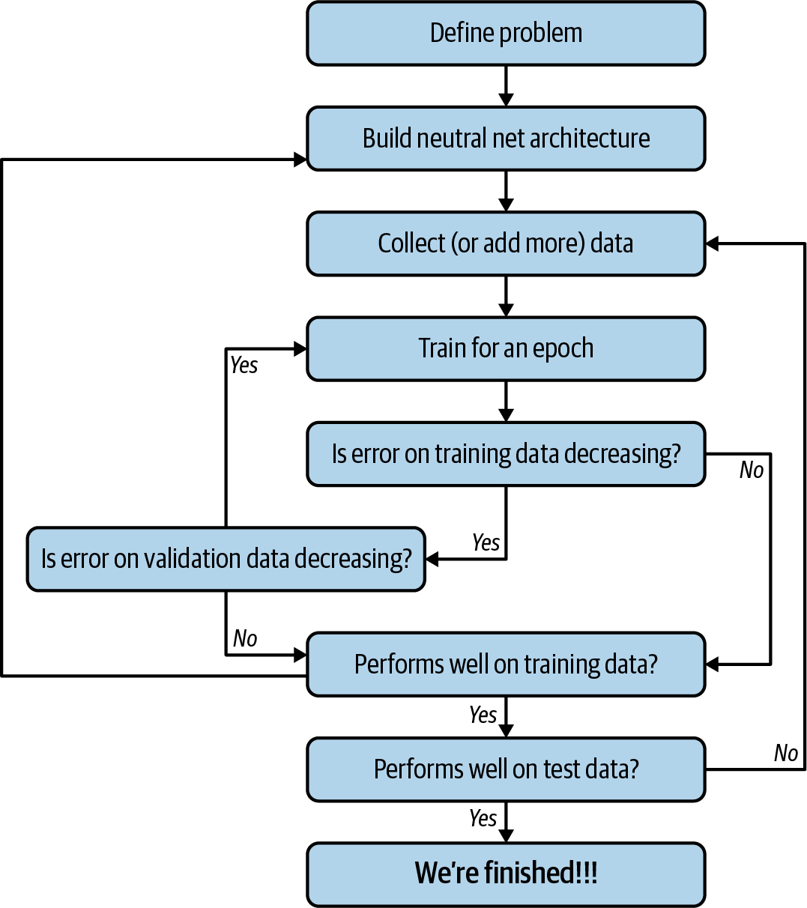

Neural network model is trained to get optimal parameters $\theta$ such that it's performance on the task is optimum.  

Basic training steps:
1. Give input training data to the model.
2. Get prediction/output from the model.
3. Find loss: how much different is model's output from ground truth(what it's supposed to be).
4. Depending upon the loss optimize the parameters, to minimize this loss.
5. Follow this steps iteratively.

$H=$ the model,  
$\theta =$ parameters of the model,  
$x=$ input data to the model,  
$y =$ exepected output from the model or the ground truth,  
$H(x,\theta) = \hat y=$ the model's output for $x$,  

then,  
$L(y,\hat y)=$ loss, the difference measure between ground truth and model's output,  

We have to minimize this loss w.r.t. $\theta$.  
This we can do because,  
$L(y,\hat y)$ is function of model's output $H(x,\theta)$ which is the function of $\theta$. We would need to apply chain rule.  

Typically gradient-descent algorithm with modifications are used.  

----
# Backpropagation

$x_i =$ i'th input to the model,  
$\hat y_i$ = model output for $x_i$,  
$y_i =$ ground truth for $x_i$,  
$K =$ number of hidden layer in the model,  
$h^{(k)}=$ k'th hidden layer of the model,  
$W^{(k)}=$ Weights as matrix connecting (k-1)'th hidden layer with k'th,  
$W^{(o)}=$ Weight as matrix connecting the $K$'th hidden layer with output layer, 
$\therefore W^{(1)}$ connects input layer with first hidden layer,  
$a^{(k)}=$ activation function of the k'th layer,  
$x_i^{(k)}=$ the output of k'th layer when $x_i$ is the input,  

$\therefore x_i^{(k)} = a^{(k)}(W^{(k)}x_i^{(k-1)})$  
then, 

$$\begin{aligned}
\hat y &= W^{(o)}x_i^{(K)} \\
&= W^{(o)}a^{(K)}(W^{(K)}x_i^{(K-1)}) \\
&= W^{(o)}a^{(K)}(W^{(K)}a^{(K-1)}(W^{(K-1)}x_i^{(K-2)}) \\
&= W^{(o)}a^{(K)}(W^{(K)}a^{(K-1)}(W^{(K-1)}...a^{(2)}(W^{(2)}x_i^{(1)})...) \text{  //till upto second hidden layer}\\
&= W^{(o)}a^{(K)}(W^{(K)}a^{(K-1)}(W^{(K-1)}...a^{(2)}(W^{(2)}a^{(1)}(W^{(1)}x_i))...)
\end{aligned}$$

$\hat y$ is function of parameters $W$.  

Thus, $L(y,\hat y)$ is function of $W$.  

$$\large \begin{aligned}
\frac{\partial L(y, \hat y)}{\partial w_{ij}} &= \frac{\partial L}{\partial \hat y} \frac{\partial \hat y}{\partial w_{ij}} \\
\frac{\partial L(y, \hat y)}{\partial w_{ij}} &= \frac{\partial L}{\partial \hat y} \frac{\partial (W^{(o)}x_i^{(K)})}{\partial w_{ij}} \\
\frac{\partial L(y, \hat y)}{\partial w_{ij}} &= \frac{\partial L}{\partial \hat y} \frac{\partial (W^{(o)}a^{(K)})}{\partial w_{ij}} \\
\frac{\partial L(y, \hat y)}{\partial w_{ij}} &= \frac{\partial L}{\partial \hat y} \frac{\partial \hat y}{\partial a^{(K)}} \frac{\partial a^{(K)}}{\partial w_{ij}} \\
\frac{\partial L(y, \hat y)}{\partial w_{ij}} &= \frac{\partial L}{\partial \hat y} \frac{\partial \hat y}{\partial a^{(K)}} \frac{\partial a^{(K)}(W^{(K)}x_i^{(K-1)})}{\partial w_{ij}} \\
\frac{\partial L(y, \hat y)}{\partial w_{ij}} &= \frac{\partial L}{\partial \hat y} \frac{\partial \hat y}{\partial a^{(K)}} \frac{\partial a^{(K)}(W^{(K)}a^{(K-1)})}{\partial w_{ij}} \\
\frac{\partial L(y, \hat y)}{\partial w_{ij}} &= \frac{\partial L}{\partial \hat y} \frac{\partial \hat y}{\partial a^{(K)}} \frac{\partial a^{(K-1)}}{\partial w_{ij}} \\
\frac{\partial L(y, \hat y)}{\partial w_{ij}} &= \frac{\partial L}{\partial \hat y} \frac{\partial \hat y}{\partial a^{(K)}} \frac{\partial a^{(K-1)}}{\partial a^{(K-2)}}...\frac{\partial a^{(k)}}{\partial w_{ij}}\\
\end{aligned}$$

#TODO 

# Overfitting
The model when exposed to an unrepresentative training data starts to fit too much to the training data, even it's noise aside from the feature dependencies. And if training data is not representative of the whole dataset then model cannot generalize to the whole dataset. This is called overfitting.  
There are certain methods to prevent overfitting discussed in [Preventing overfitting](./Preventing%20overfitting.md).
