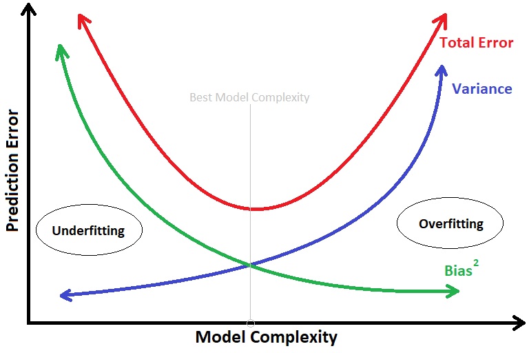

Basic training flow:

$H=$ the model,  
$\theta =$ parameters of the model,  
$x=$ input data to the model,  
$y =$ exepected output from the model or the ground truth,  
$H(x,\theta) = \hat y=$ the model's output for $x$,  

then,  
$L(y,\hat y)=$ loss, the difference measure between ground truth and model's output,  

We have to minimize this loss w.r.t. $\theta$.  
This we can do because,  
$L(y,\hat y)$ is function of model's output $H(x,\theta)$ which is the function of $\theta$.  

----
# Backpropagation

$x_i =$ i'th input to the model,  
$\hat y_i$ = model output for $x_i$,  
$y_i =$ ground truth for $x_i$,  
$K =$ number of hidden layer in the model,  
$h^{(k)}=$ k'th hidden layer of the model,  
$W^{(k)}=$ Weights as matrix connecting (k-1)'th hidden layer with k'th,  
$W^{(o)}=$ Weight as matrix connecting the $K$'th hidden layer with output layer, 
$\therefore W^{(1)}$ connects input layer with first hidden layer,  
$a^{(k)}=$ activation function of the k'th layer,  
$x_i^{(k)}=$ the output of k'th layer when $x_i$ is the input,  

$\therefore x_i^{(k)} = a^{(k)}(W^{(k)}x_i^{(k-1)})$  
then, 

$$\begin{aligned}
\hat y &= W^{(o)}x_i^{(K)} \\
&= W^{(o)}a^{(K)}(W^{(K)}x_i^{(K-1)}) \\
&= W^{(o)}a^{(K)}(W^{(K)}a^{(K-1)}(W^{(K-1)}x_i^{(K-2)}) \\
&= W^{(o)}a^{(K)}(W^{(K)}a^{(K-1)}(W^{(K-1)}...a^{(2)}(W^{(2)}x_i^{(1)})...) \text{  //till upto second hidden layer}\\
&= W^{(o)}a^{(K)}(W^{(K)}a^{(K-1)}(W^{(K-1)}...a^{(2)}(W^{(2)}a^{(1)}(W^{(1)}x_i))...)
\end{aligned}$$

$\hat y$ is function of parameters $W$.  

Thus, $L(y,\hat y)$ is function of $W$.  

$$\large \begin{aligned}
\frac{\partial L(y, \hat y)}{\partial w_{ij}} &= \frac{\partial L}{\partial \hat y} \frac{\partial \hat y}{\partial w_{ij}} \\
\frac{\partial L(y, \hat y)}{\partial w_{ij}} &= \frac{\partial L}{\partial \hat y} \frac{\partial (W^{(o)}x_i^{(K)})}{\partial w_{ij}} \\
\frac{\partial L(y, \hat y)}{\partial w_{ij}} &= \frac{\partial L}{\partial \hat y} \frac{\partial (W^{(o)}a^{(K)})}{\partial w_{ij}} \\
\frac{\partial L(y, \hat y)}{\partial w_{ij}} &= \frac{\partial L}{\partial \hat y} \frac{\partial \hat y}{\partial a^{(K)}} \frac{\partial a^{(K)}}{\partial w_{ij}} \\
\frac{\partial L(y, \hat y)}{\partial w_{ij}} &= \frac{\partial L}{\partial \hat y} \frac{\partial \hat y}{\partial a^{(K)}} \frac{\partial a^{(K)}(W^{(K)}x_i^{(K-1)})}{\partial w_{ij}} \\
\frac{\partial L(y, \hat y)}{\partial w_{ij}} &= \frac{\partial L}{\partial \hat y} \frac{\partial \hat y}{\partial a^{(K)}} \frac{\partial a^{(K)}(W^{(K)}a^{(K-1)})}{\partial w_{ij}} \\
\frac{\partial L(y, \hat y)}{\partial w_{ij}} &= \frac{\partial L}{\partial \hat y} \frac{\partial \hat y}{\partial a^{(K)}} \frac{\partial a^{(K-1)}}{\partial w_{ij}} \\
\frac{\partial L(y, \hat y)}{\partial w_{ij}} &= \frac{\partial L}{\partial \hat y} \frac{\partial \hat y}{\partial a^{(K)}} \frac{\partial a^{(K-1)}}{\partial a^{(K-2)}}...\frac{\partial a^{(k)}}{\partial w_{ij}}\\
\end{aligned}$$

#TODO 

# Overfitting and Underfitting

### Overfitting
>**Overfitting:** A hypothesis $h$ is said to have overfit when there exists an alternative hypothesis $h'$ such that the error of $h$ on train data is lower than error of $h'$ but $h'$ has lower error on test data.  

The model starts to fit too much to the training data, even it's noise aside from the feature dependencies.  

Possible causes:
1. Training data is not representative of the whole data distribution.
2. Too complex model.
3. Too many epochs run.

Methods to prevent overfitting:
1. Data augmentation: Make the training data representative of total data distribution.
2. Early stopping: Using validation set.
3. [Regularization](./Preventing%20overfitting.md): Decrease model complexity.
3. [Dropout](./Preventing%20overfitting.md).

### Underfitting
The model doesnt perform well, both train and test data.

Possible causes:
1. Too simple model.
2. The search space is too vast.
3. Ran less number of epochs.

Methods to prevent:
1. Increase the complexity of the model.
2. Change the architecture.
3. Run for more number of epochs.

## Bias variance tradeoff

