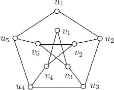
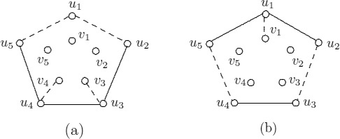

----
> **Theorem 2.1 (The First Theorem of Graph Theory)  
> If G is a graph of size $m$ then,**  
> $$\large \sum_{v\in V(G)}{deg(v_i)}=2m$$

**Proof:**
Since, each edge is incident on two vertices.  
each edge adds 2 to sum of degrees.  
$\therefore$ For $m$ edges we have sum of degrees = $2m$
$$[Proved!]$$

> **Corollary 2.3
> Every graph has an even number of odd vertices.**

**Proof:**
Let, $V(G)=V(G_1)\cup V(G_2)$, where  
$G_1$= set of even vertices  and let $\sum_{v\in V(G_1)}{deg(v_i)}=2l$  
$G_2$= set of odd vertices.  

$$\large \therefore \sum_{v\in V(G_1)}{deg(v_i)} + \sum_{v\in V(G_2)}{ deg(v_i)}= \sum_{v\in V(G)}{deg(v_i)}$$

$$\large 2l + \sum_{v\in V(G_2)}{deg(v_i)} = 2m$$

$$\large \sum_{v\in V(G_2)}{deg(v_i)} = 2(m-l) = even\ number$$

$$\implies \text{Sum of degrees in $G_2$ should be an even number}$$

$$Since, \text{every vertex in $G_2$ has odd degree}$$

$$\implies \text{There should be even number of vertex in $G_2$}$$

$$\text{[Since for only even count of odd numbers,the sum is even.]}$$

$$[Proved!]$$

----
> **Theorem 2.4
> Let G be a graph of order $n$. If  
> $$\large deg(u)+deg(v)\ge n-1$$
> for every two nonadjacent vertices  $u$ and $v$ of G. Then G is connected and $diam(G)\lt2$.**

**Proof:**  
**Claim-I:** G is connected.  
	Case-I: If $u$ and $v$ are adjacent then its anyway connected.  
	Case-II: If $u$ and $v$ are not adjacent then:  
		$deg(u)+deg(v)\ge n-1 \implies$ $u$ and $v$ has at-least one common vertex,  
		because G is a simple graph(no parallel edges).
$\therefore$ G is connceted.  

**Claim-II:** $diam(G)<2$  
$\because$ Every non-adjacent vertices have a common neighbouring vertex.  
$\implies$ Max distance between any two vertices = 2.  
$\therefore diam(G)=2$
$$[Proved!]$$

> **Corollary 2.5
> If G is graph of order $n$ with $\delta(G)\ge\frac{n-1}{2}$ then G is connected.**

**Proof:**  
For any two given vertices $u$ and $v$,  
$$deg(u)+deg(v)= \frac{n-1}{2} + \frac{n-1}{2} =  n-1$$
$\therefore$ By Theorem G is connected.  
$$[Proved!]$$

----
> **Theorem 2.6:
> Let $r$ and $n$ be integers with $0\le r \le n-1$. There exists an r-regular graph of order $n$ iff one of $r$ or $n$ is even.**

**Proof:**  
**Claim-I:** If there exists r-regular graph of order n then at least one of $r$ or $n$ is even.  
Proof by contradiction: Suppose both $r$ and $n$ are odd.  
Then, it would contradict The First Theorem of Graph Theory.  
Thus at least one of them need to be even.  

**Claim-II:** If at least one of $r$ or $n$ is even then there exists a r-regular graph of order $n$.
Proof by Construction:   
We construct $H_{r,n}$ r-regular Harary graph with $V(H_{r,n})=\{v_1,v_2,...,v_n\}$  
Case-I: $r$ is even.  
Let $r=2k$.  
$\forall 1\le i\le n$ connect $v_i$ to $v_{i-k},...,v_{i-2},v_{i-1},v_{i+1},v_{i+2},...,v_{i+k}$  
Thus constructed graph is r-regular with order $n$.  

Case-II: $r$ is odd.  
Let $r=2k+1$.  
Follow case-I procedure to get (r-1)-regular graph.  
$\because\ r$ is odd $\implies\ n$ is even $\implies$ we can find opposite vertex for every vertex.  
Now join every $v_i$ with its opposite vertex $\large v_{(i+\frac{n}{2})mod(n)}$.  
Thus we get r-regular graph.

$$[Proved!]$$

----
> **Theorem 2.7
> For every graph $G$ with $r \ge \Delta(G), \exists$ r-regular graph $H$ containing $G$ as an induced subgraph.**  

**Proof by Construction:**  (Konig's construction)  
Let $\large V(G)=\{v_1, v_2,...,v_n\}$  
Create $G's$ shadow graph $G'$ whose each vertex $v_i'$ corresponds to $v_i$ in $G$.  
For every $v_i$ with degree $\lt r$  
it's counterpart $v_i'$ also has degree $\lt r$.  
Add edge $v_iv_i'$ .  

Now, if there still exists vertices with degree < $r$.  
 Again create a shadow copy of the whole graph and add edges as in previous step.  

Repeat this until all vertices have degree $r$.  

Thus doing so for every graph gives us graph $H$ whose all vertices have degree $r$.  
And $G$ is induced subgraph of r-regular graph $H$.  
$$[Proved!]$$

----
>**Theorem 2.10 (Havel-Hakimi Theorem)  
> A non-decreasing sequence $\large s: d_1, d_2, d_3,...,d_n$ of non-negative integers is graphical iff $\large s_1: d_2-1,d_3-1,...,d_{d_1+1}-1, d_{d_1+2},...,d_n$ is graphical.**

**Proof:**  
**Claim-I:** If $s1$ is graphical then $s$ is graphical.  
Let, graph $G_1$ correspond to $s_1$.  
Let, $V(G)=\{v_2,v_3,...,v_n\}$ such that  
$$\large deg(v_i) = \cases{d_i-1,  \ 2\le i\le d_1+1 \\ d_i, \ d_1+2\le i \le n}$$

Now construct graph $G$ by  adding a vertex $v$ to $G_1$ and edges $\large (vv_i) \forall 2\le i \le d_1+1$.
$\implies deg(v)=d_1$  
And $s$ is degree sequence of $G$.  
$\implies s$ is graphical.

**Claim-II:** If $s$ is graphical then $s_1$ is graphical.  
Let $G$ be graph with degree sequence $s$.  
Let, $V(G)=\{v_1, v_2,...,v_n\}$.  
Case-I: If $v_1$ is adjacent to $\large v_2, v_3,...,v_{d_1+1}$  
Then $G-v_1$ has degree sequence $s_1$, thus $s_1$ is graphical.

Case-II: If $v_1$ is not adjacent to one of these $\large v_2, v_3,...,v_{d_1+1}$   
$\implies v_1$ is adjacent to say $\large v_s, s>d_1+1$ and say $v_1$ is not adjacent to $\large v_r, r\le d_1+1$.  
Now, $\large \because deg(v_r)>deg(v_s) \implies \exists v_t$ such that $v_r$ is adjacent to $v_t$ but $v_s$ is not adjacent to $v_t$.  
$\therefore$ The confirmed edges we are having are: $\large v_1v_s, v_rv_t$  
Now, remove $\large v_1v_s, v_rv_t$ and add edges $\large v_1v_r, v_sv_t$.  
The resultant graph $G_1$ still remains graphical.  
Following same manner we can make $v_1$ adjacent to $v_i, i\le 2 \le d_1+1$ in graph $G_1$.  
$\therefore G_1$ will have degree sequence $s_1$.
$\implies s_1$ is graphical.

$$[Proved!]$$

----
> **Theorem 3.1**
> $$G\cong H \iff \bar G \cong \bar H$$

**Proof:**   
$\exists \phi:V(G) \to V(H)$  
**Claim-I:** $G\cong H \implies \bar G \cong \bar H$  
Let, $u,v \in V(G)$, then  
$uv \in E(G) \iff \phi(u)\phi(v) \in E(H)$  and $uv \notin E(G) \iff \phi(u)\phi(v) \notin E(H)$  
$\therefore uv \notin E(\bar G) \iff \phi(u)\phi(v) \notin E(\bar H)$  and $uv \in E(\bar G) \iff \phi(u)\phi(\bar v) \in E(\bar H)$  
$\implies \phi: V(\bar G) \to V(\bar H)$  
$\implies \bar G \cong \bar H$  

**Claim-II:** $\bar G\cong \bar H \implies G \cong H$  
Similar to case-I.  
$$[Proved!]$$

----
> **Theorem 3.2
> $G \cong H \implies$ degrees of the vertices of G are the same as the degrees of the vertices of H.**

**Proof:**  
Let, $u \in V(G)$ and $v=\phi(u) \in V(H)$  
If $u$ is adjacent to $x_1, x_2,...,x_k$ and not adjacent to $w_1, w_2,...,w_l$ such that $|V(G)|=k+l+1$.  
$\implies deg(u)=k$  
$\therefore v$ is adjacent to $\phi(x_1), \phi(x_2),...,\phi(x_k)$ and not adjacent to $\phi(w_1), \phi(w_2),...,\phi(w_l)$ such that $|V(H)|=k+l+1$.   
$\implies deg(v)=k$  
$\therefore deg(u)=deg(v)$  
$$[Proved!]$$

----
> **Theorem 3.5  
>  Let $G \cong H$, then  
> (a) G is bipartite $\iff$ H is bipartite  
> (b) G is connected $\iff$ H is connected.**

**Proves:**  
Let $\phi:V(G) \to V(H)$  

(a)
**Proof:**  
Claim-I: $G$ is bipartite $\implies$ $H$ is bipartite.  
$\because G$ is bipartite let $V(G)=V_1(G)\cup V_2(G)$, such that  
$V_1(G) \cap V_2(G) = \emptyset$  

First we show that there is corresponding vertex partition for $H$ too.  
Let, $W_1(H) = \{\phi(u) \ such\ that\ u \in V_1(G)\}$  
$W_2(H) = \{\phi(v) \ such\ that\ v \in V_2(G)\}$  
Now, for any $a \in W(H) \exists u \in V(G)$ such that $u \in V_1(G) \ or \ V_2(G)$ but not both.  
$\implies a \in W_1(H) \ or \ W_2(H)$ but not both.  
$\implies W_1(H) \cup W_2(H) = W(H)$ and $W_1(H) \cap W_2(H) = \emptyset$  

Now we show that any edge in E(H) joins vertices between these two vertex partitions only, and not within a partition.  
Let, $ab = e \in E(H)$ where $a,b\in W(H)$  
Now, $\exists u,v \in V(G)$ such that $a=\phi(u)$ and $b=\phi(v)$.  
$\because G$ is bipartite $u$ and $v$ belongs to different partite $V_1(G)$ and $V_2(G)$.  
$\implies \phi(u),\phi(v)=a,b$ also belongs to different vertex sets $W_1(H)$ and $W_2(H)$.  
$\implies e$ always joins vertices of two different vertex sets $W_1(H)$ and $W_2(H)$.  
$\implies H$ is also bipartite.

Claim-II: If $H$ is bipartite, then $G$ is bipartite.
$\because \phi^{-1}$ exists, as $\phi$ is a bijective function.  
Proof similar to claim-I follows.  
$$[Proved!]$$

(b)
**Proof:**  
Let, $u,v \in V(G)$  
If $u-v$ path exists in $G$, then $\phi(u)-\phi(v)$ path exists in $H$.  
$\implies$ If all vertices in $G$ are connected by a path, then corresponding vertices in $H$ are also connected.  
$\implies$ If G is connected H is also connected.

Now, $\exists \phi^{-1}: V(H) \to V(G)$, since  $\phi$ is a bijective function.  
Similaryly, we can show that  
If $H$ is connected, then $G$ is also connected.  
$$[Proved!]$$

----
> **Theorem 3.6:  
> Isomorphism is an equivalence relation on the set of all graphs.**

**Proof:**  
**Reflexive:**  
Let, $\phi$ be an identity function , $\phi: V(G) \to V(G)$  
$\therefore uv \in E(G) \iff \phi(u)\phi(v) \in E(G)$  
$\therefore G \cong G$  
$\phi$ an isomorphism is reflexive.  

**Symmetric:**  
Let, $\phi: V(G_1) \to V(G_2)$  
$\because \phi$ is bijective.  
$\exists \phi^{-1}:V(G_2) \to V(G_1)$  such that  
$uv \in V(G_2) \implies \phi^{-1}(u)\phi^{-1}(v) \in V(G_1)$  
and $uv \notin V(G_2) \implies \phi^{-1}(u)\phi^{-1}(v) \notin V(G_1)$  
$\therefore uv \in V(G_2) \iff \phi^{-1}(u)\phi^{-1}(v) \in V(G_1)$  
Thus $\phi^{-1}$ is an isomorphism: $V(G_2) \to V(G_1)$  
$\therefore G_1 \cong G_2 \implies G_2 \cong G_1$  
$\therefore$ Isomorphism is symmetric.  

**Transitive:**  
Let,  
$\alpha: V(G_1) \to V(G_2) \implies G_1 \cong G_2$  
$\beta: V(G_2) \to V(G_3) \implies G_2 \cong G_3$  
Now,  
$uv \in E(G_1) \iff \alpha(u)\alpha(v) \in E(G_2)$  
and $\alpha(u)\alpha(v) \in E(G_2) \iff \beta(\alpha(u))\beta(\alpha(v)) \in E(G_2)$  
or $\alpha(u)\alpha(v) \in E(G_2) \iff (\beta \circ \alpha)(u)(\beta\circ\alpha)(v) \in E(G_2)$  
But $\because \alpha \ and \ \beta$ are bijective $\implies (\beta \circ \alpha)$ is also bijective.  
$\therefore uv \in E(G_1) \iff (\beta \circ \alpha)(u)(\beta\circ\alpha)(v) \in E(G_2)$  
$\therefore G_1 \cong G_2$  
$\therefore$ isomorphism is transitive.  
$$\therefore \text{Isomorphism is an equivalence relation}.$$

$$[Proved!]$$

----
> **Theorem 4.1:  
> An edge $e$ of graph $G$ is a bridge iff $e$ lies on no cycle of G.**

**Proof:**  
**Claim-I:** If $e$ is a bridge, then $e$ lies on no cycle of G.  
Proof by contradiction: Let $e$ be a bridge that lies on cycle of G.  
Let, $e=uv$, thus $e$ joins vertices $u,v \in V(G)$  
We show that $G-e$ is still connected.  
$\because uv$ lies in a cycle $\implies in\ G-e, \exists u-v$ path say $P$.
Take $x,y \in V(G)$.  
Case-I: $e$ didnt lie in $x-y$ path in $G$.  
$\implies$ $e$ doesnt lie in $x-y$ path in $G-e \implies x,y$ is still connected in $G-e$.  
Case-II: $e$ lie in $x-y$ path in $G$.  
In $G-e$ take walk $W(x,y)=Path(x,u) + P + Path(v,y)$.  
$\because$ Walk $W(x,y)$ exists in $G-e \implies Path(x,y)$ exists in $G-e$.  
$\therefore x,y$ is still connected.  

$\therefore G-e$ is connected $\implies e$ is not a bridge (by definition).  
$\therefore$ If $e$ is a bridge, then it wont lie on any cycle of $G$.  

**Claim-II:** If $e$ lies on no cycle of $G$, then $e$ is a bridge.  
Proof by contrapositive( $(p \implies q) \cong (\neg q \implies \neg p)$ ): If $e$ is not a bridge, then $e$ lies on cycle of $G$.   
Let, $e = uv \in E(G)$.  
$\because e$ is not a bridge.   
$\implies G-e$ contains a $Path(u,v)$.  
$\implies G$ also contains $Path(u,v)$ that is distinct from $e$.  
Now, joining $Path(u,v)$ and $e$ will form a cycle containing $e$.  
$\therefore e$ lies in a cycle in G.  

Thus, combining claim-I and claim-II,  
$$[Proved!]$$

----

>**Theorem 4.2:
>A graph G is a tree iff every two vertices of G are connected by a unique path.**

**Proof:**  

**Claim I:** If $G$ is a tree every two vertices are connected by a unique path.  
A path exists between every two vertices because $G$ is a tree.  
Now, we show that the path is unique.  
Assume the contrary, $u,v \in V(G)$ are connected by two distinct path $P_1$ and $P_2$.  
$\implies$ A cycle is formed by some or all vertices of $P_1$ and $P_2$ in $P_1 + P_2$.  
$\implies G$ cannot be a tree.
Hence the contradiction.  
$\therefore$ Every two vertices is connected by a unique path.

**Claim II:** If every two vertices of $G$ are connected by unique path then $G$ is a tree.  
$\because$ Every two vertices have a path connecting them $\implies G$ is connected.  
Now, to show $G$ is acyclic.
Assume contrary, let $u,v \in V(G)$ be part of a cycle.  
$\implies \exists$ two $u-v$ paths in $G$.  
Which is a contradiction.  
$\therefore G$ is connected and acyclic.  
$\implies G$ is a tree.

Together from Claim-I and Claim-II, Theorem holds.  
$$[Proved!]$$

----
> **Theorem 4.3:
> Every nontrivial tree has at least two end-vertices.**

Nontrivial tree: Trees with order>1.

**Proof:**  
Let $u-v$ be longest path in $T$. ($d(u,v)=diam(T)$)  
$order(T) \gt 1 \implies u \not = v$
We show that $u$ and $v$ both have degree 1.  

Let $P = (u=p_1, p_2,..., p_k=v)$.  

Take $u$,  
**Claim-I:** $u$ is  not adjacent to any other vertex other than those in $P$.  
Assume the contrary, $u$ is connected to $w$ such that $w \notin P$.  
$\implies w+P =$ longest path in $G$ for $w-v$.  
Which is contradiction to our base assumption.  
$\therefore u$ is not adjacent to any other vertex outside $P$.  

**Claim-II:** $u$ is adjacent to only one vertex - $p_2$ in $P$.  
$\because order(T) \gt 1 \implies$ we can take $p_2 \not = u$.
Assume the contrary, let $u$ be adjacent to $p_i$ for $2 \lt i \le k$.   
$\implies \exists$ two distinct $u-p_i$ paths.  
$\implies T$ is not a tree.  
Which is a contradiction.  
$\therefore u$ is connected to only $p_2$.  

$\therefore$ claim-I and claim-II $\implies deg(u)=1 \implies u$ is an end-vertex.  
$|||^{ly}$  $v$ can also be shown to be an end-vertex.  
$\therefore \exists$ two end-vertices in every non-trivial tree.  
$$[Proved!]$$

----
> **Theorem 4.4:
> Every tree of order $n$ has size $n-1$.**

**Proof:** (By Induction)
A tree of order 1 has size 0.  
$\therefore$ The statement is true for $n=1$.

Assume that statement is true for integer $n \gt 1$.  
$\implies$ A tree of order $n$ has size $n-1$.  

Now, let $T$ be a tree of order $n+1$.  
$\because \exists$ two end-vertices for every non-trivial tree.  
$\because$$n+1 \gt 2 \implies T$ is non-trivial,  
Let $v$ be an end-vertex of $T$.  
$\implies$ tree $T-v$ has order $n$.  
$\because v$ was an end-vertex of $T \implies size(T) = size(T-v)+1$.  
But by assumption tree $T-v$ of order $n$ has size $(n-1)$.  
$\implies T$ of order $(n+1)$ has size $(n-1)+1=n$.  
$\therefore$ Statement is true for $n+1$ whenever its true for $n$.  
$\because$ Statement is true for $n=1 \implies$ Its true for all integers $n \ge 1$.  
$$[Proved!]$$

> **Corollary 4.6:  
> Every forest of order $n$ with $k$ components has size $n-k$.**

**Proof:**  
Joining the $k$ components by $k-1$ edges gives us a tree, say $T$.
Order of $T=n$.  
$\therefore$ size of $T=n-1$.  
Now,
$$\begin{aligned}\text{Size of T}
&= \text{ Sum of sizes of $k$ components} + (k-1) \\
&= \text{Size of original forest} + (k-1) \\
\text{or, Size of original forest} &= \text{Size of T} - (k-1) \\
&= (n-1) - (k-1) \\
\therefore \text{Size of original forest} &= n-k
\end{aligned}$$

$$[Proved!]$$

----
> **Theorem 4.7:  
> The size of every connected graph of order $n$ is at least $n-1$.**

**Proof:**  (By minimum value)  
$S_1$: Connected graph of order 1 has size at least 0.  
(A trivial graph.)  
$S_2$: Connected graph of order 2 has size at least 1.  
(A pair graph of order 2.)  

Let, $n \ge 2$ be the least number for which $S_n$ fails.  
$\therefore S_n$: Connected graph $G$ of order $n$ has size at most $(n-2$).  
Claim: $G$ has at least one end vertex.  
Assume the contrary, $G$ has no end vertex.  
$\implies deg(v) \ge 2 \forall v \in V(G)$  
$\implies \sum_{v\in V(G)}{deg(v)} \ge 2n$  
$\implies$ Size of $G \ge n$.   
Which is a contradiction.  
$\therefore G$ has at least one end vertex.  

Let, $v$ be that end-vertex.  
$\therefore G-v$ is graph of order $(n-1)$ and size at most $((n-2)-1)$.  
Let, $n'=n-1 \implies \exists$ graph $G'$ with order $n'$ and size at most $(n'-2)$.  
$\implies n$ for $S_n$ is not the least number and $G$ is not smallest graph of order $n$ and size $(n-2)$.  
Hence the contradiction.  
$\therefore$ There exists no minimum $n \ge 2$ such that $S_n$ fails.  
$$[Proved!]$$

Another way to think is,  
we saw that if  $n \ge 2$ exists such that $S_n$ doesn't hold, then $(n-1)$ also exists for which $S_{n-1}$ does not hold.  
$\implies S_{n-2}, S_{n-3}, ... , S_3, S_2, S_1$ also doesn't hold.  
But as we saw in starting of proof  
$S_1, S_2$ holds for every possible connected graph of order 1 and 2.  
Hence the contradiction.

----
**Theorem 4.8:  
Let G be a graph of order $n$ and size $m$. If $G$ satisfies any two of following properties:  
1. $G$ is connected.
2. $G$ is acyclic.
3. $m=n-1$
**Then $G$ is a tree.**

**Proof:**

**Case-I: (1) and (2) holds.**  
Then by definition of tree, $G$ is a tree.  

**Case-II: (1) and (3) holds.**  
We show that $G$ is acyclic.  
Assume contrary, $G$ has a cycle.  
Remove an edge $e$ from the cycle.  
$G-e$ is still connected.  
$\implies G$ is a connected graph of order $n$ and size $(n-1)-1)=n-2$.  
But The size of every connected graph of order $n$ is at least $n-1$.  
Hence the contradiction.  
$\implies G$ is acyclic and $\because$ (1) holds $G$ is connected.  
$\implies G$ is a tree.  

**Case-III: (2) and (3) holds.**  
$\because G$ is acyclic $\implies G$ is either a tree or a forest.  
Assume $G$ is a forest of order $n$ with $k$ components.  
By (3) $G$ has size $(n-1)$.  
$\because G$ is a forest of order $k$ and order of $G$ is $n$.  
$\implies$ Size of $G=n-k$  
or, $n-k=n-1$  
$\implies k=1$  
$\therefore G$ contains only one component.  
$\implies G$ is a tree.

$$[Proved!]$$

----
> **Theorem 4.9:**  
> Let $T$ be a tree of order $k$. If $G$ is a graph with $\delta(G) \ge k-1$, then $T$ is isomorphic to some subgraph of $G$.

**Proof:**  (By Induction)  
For $k=1$,  
$\because$ every graph contains a vertex.  
Tree of order $1$ is isomorphic to all $G$ with $\delta(G) \ge 0$.  
For $k=2$,  
$\because \exists$ an edge joining two vertices in $G$.  
Tree of order $2\ (P_2)$  is isomorphic to all $G$ with $\delta(G) \ge 1$.  

Assume the theorem is true for $k \ge 3$.  
i.e., A tree of order $k$ is isomorphic to a subgraph of $G$ with $\delta(G)\ge k$.  

For $k+1$,  
Let $T$ be a tree of order $k+1$ and $G$ be a graph with $\delta(G) \ge k$.  
$\because$ Every non-trivial tree has at-least two end vertices.
Let $v$ be an end vertex in $T$, such that $u,v \in V(T)$ and $uv \in E(T)$.  
$\implies T-v$ is a tree of order $(k)$.  
$\because$ by assumption a tree of order $k$ is isomorphic to a subgraph of $G$.  
Let $T-v \cong H$ where $H$ is subgraph of  $G$.  
Now, $deg_{H}(u) \le k-1$.  
But $deg_G(u) \ge k$.  
$\implies \exists w \in V(G)$ such that $w \notin V(H)$ and $uw \in E(G)$.  
$\implies T \cong H\cup \{w,uw\}$, subgraph of $G$.  

$\therefore$ Theorem holds for $k+1$ if it holds for $k$.  
$\because$ Theorem is true for $k=1,2 \implies$ Theorem is true for integers $k \ge 1$.  
$$[Proved!]$$ 

----
> **Theorem 4.10:**  
> Every connected graph contains a spanning tree.

**Proof:**  (By Construction)  
$G \gets$ connected graph.  
**Algorithm-I:** Removing edges.  
**Case-I:** If $G$ is acyclic then $G$ is spanning tree itself.  
**Case-II:** If $G$ is cyclic.  
Remove and edge $e$ from a cycle of $G$.  
Repeat until no cycle is present.  
The resultant graph is a spanning tree of $G$.  
  
**Algorithm-II:** Adding edges.  
1. $H \gets$ a graph with $V(H)=V(G), E(H)=\emptyset$.  
2. While $(H \text{ is not connected})$
	1. Keep adding edge $e$ from $E(G)$ such that no cycle is formed in $H$.
3. $H$ is a spanning tree of $G$.  

$$[Proved!]$$

----
>**Theorem 4.11:  
>Kruskal's algorithm produces a minimal spanning tree in a connected weighted graph.**

**Proof:**  
Let $G$ be a connected weighted graph of order $n$.  
Let $T$ be spanning tree obtained by Kruskal's algorithm.  
Assume, T's edges are selected in order $e_1,e_2,...,e_{n-1}$, such that $w(e_1)\le w(e_2)\le ... \le w(e_{n-1})$.  
$\therefore$ weight of $T$ = $w(T)=\sum_{i=1}^{n-1}w(e_i)$.  

Assume that $T$ is not a MST and among all MST let $H$ be the one sharing maximum common edges with $T$.  

Let $e_i$ be first edge in $T$ that is not there in $H$.  
$\implies$ edges $e_1,e_2,...,e_{i-1}$ are common to both $T$ and $H$.  
Let $G_0 = H + e_i$.  
$\therefore G_0$ contains a cycle $C$.  
$\because T$ is a tree. $\exists$ an edge $e_0$ in cycle $C$ such that $e_0 \notin E(T)$.  
Let $G_1 = G_0 - e_0$.  
or $G_1 = H + e_i -e_0$.  

$\because H$ is a MST $\implies w(H) \le w(G_1)$.  
$\implies w(H) \le w(H) +w(e_i)-w(e_0) \implies w(e_0) \le w(e_i)$.  
And by Kruskal's algorithm $e_i$ was the the minimum weight edge that could be added to edges $e_1,e_2,...,e_{i-1}$ withoout producing a cycle.  
But $e_0$ also could have been added.  
$\implies w(e_i)\le w(e_0)$  
$\therefore w(e_i) = w(e_0)$  

$\implies w(G_1)=w(H)$  
$\therefore G_1$ is a MST.  
And $G_1$ has more common edges with $T$ than $H$.  
Which contradicts our assumption.

$$[Proved!]$$

----
>**Theorem 4.12:  
>Prim's Algorithm produces a minimum spanning tree in a connected weighted graph.**

**Proof:**  
Let $T$ of order $n$ be a spanning tree obtained by Prim's algorithm.  
The edges of $T$ are selected in order $e_1,e_2,...,e_{n-1}$ where $e_1$ is incident with vertex $u$.  
$\therefore w(T)=\sum_{i=1}^{n-1}w(e_i)$  

Assume to contrary that $T$ is not a MST and $H$ be the set of all MST of $G$ having a maximum number of edges in common with $T$.  
$k=$ numbe of common edges between $T$ and MST in $H$.  
If there are no common edges then $k=0$ and $H'$ be any tree in $H$.  
Otherwise, $k=$ maximum positive integer, such that $\exists H' \in H$ containing $e_1,e_2,...,e_k$.  
$\therefore$ no tree in $H$ contains all of the edges $e_1,e_2,...,e_k,e_{k+1}$.  
$\because H'$ is a MST that does not contain $e_{k+1}$.  
$\implies H'+e_{k+1}$ forms a cycle $C$.  
Necessarily $C$ contains an edge $e_0$ distinct from $e_{k+1}$ such that $e_0 \notin T$.  
Let $T' = H' - e_{k+1}+e_0$.  
$\therefore w(T')=w(H')-w(e_{k+1})+w(e_0)$  
$\because H'$ is a MST $\implies w(H') \le w(T')$  
$\implies w(e_0) \le w(e_{k+1})$  
And by the contruction of $T$ from Prim's algorithm, $w(e_{k+1}) \le w(e_0)$.  
$\implies w(e_0)=w(e_{k+1})$  
$\implies w(T')=w(H') \implies T'$ is a MST with $k+1$ edges common with $T$.  
$\implies T' \in H$ with $k+1$ common edges.  
Which contradicts assumption that $H' \in H$ is MST with max common edges with $T$.  

$$[Proved!]$$

----
## Connectivity

> **Theorem 5.1:  
> A vertex $v$ incident with a bridge in a connected graph $G$ is cut vertex iff $deg(v)\ge 2$.**

**Proof:**  
Let $uv \in E(G)$ be the bridge incident to $v$.  

**Claim I:** If $v$ is a cut vertex incident with a bridge then $deg(v)\ge 2$.  
Assume to contrary that $deg(v)=1$.  
$\implies v$ is an end-vertex $\implies G-v$ is connected.  
$\implies v$ cannot be a cut vertex.  

**Claim II:** If $deg(v) \ge 2$ and $v$ is incident with a bridge then $v$ is a cut vertex.  
$\therefore \exists w \in V(G)$ distinct from $u$ such that $vw \in E(G)$.  
Assume to contrary that $v$ is not a cut vertex.  
$\implies G-v$ is connected $\implies P=u-w$ path exists in $G-v$.  
$\implies P+uv$ forms a cycle in $G \implies uv$ is part of a cycle.  
But $uv$ is a bridge, and bridges cannot be part of a cycle.  
Hence, contradiction.  

$$[Proved!]$$

>**Corollary 5.2:  If $G$ contains a bridge then $G$ contains a cut vertex.**

----
>**Theorem 5.3:  
>Let $v$ be a cut-vertex in a connected graph $G$ and let $u$ and $w$ be vertices in distinct components of $G-v$. Then $v$ lies on every $u-w$ path in $G$.**

**Proof:**  
Assume to contrary that $v$ doesnt lie on every $u-w$ path.  
$\implies \exists$ path $P$ such that $v$ doesnt lie in $P$.  
$\implies P$ exists in $G-v \implies u$ and $w$ are connected in $G-v$.  
$\implies u$ and $w$ lie in the same component of $G$.  
which is a contradiction as $u$ and $w$ comes from distinct components of $G-v$.  

$$[Proved!]$$

>**Corollary 5.4: A vertex $v$ of a connected graph $G$ is a cut vertex of $G$ iff there exist vertices $u$ and $w$ distinct from $v$ such that $v$ lies on every $u-w$ path of $G$.**

**Proof:**  
**Claim I:** If $v$ is a cut vertex of a connected graph $G$, then there exists $u$ and $w$ such that $v$ lies in every path of $u-w$.  
Take, $u$ and $w$ from different components of $G-v$.  
$\therefore$ by theorem $v$ lies in every path of $u-w$.  

**Claim II:** If there exists vertices $u$ and $w$ distinct from $v$ such that $v$ lies in every $u-w$ path then $v$ is a cut vertex.  
$\implies$ there exists no path connecting $u$ and $w$ in $G-v$.  
$\implies G-v$ is disconnected.  
$\implies v$ is a cut vertex.  

$$[Proved!]$$

----
>**Theorem 5.5:  
>Let $G$ be a nontrivial connected graph and let $u \in V(G)$.  
>If $v$ is a vertex that is farthest from $u$ in $G$, then $v$ is not a cut vertex of $G$.**

**Proof:** (Contrapositive)
Contrapositive: If $v$ is cut vertex of $G$, then $v$ is not the farthest vertex from $u$.  
$\because v$ is a cut vertex, let $w$ belong to component in $G-v$ that doesnt contain $u$.  
$\implies$ all $u-w$ path contains $v$.  
$\implies d(u,w) \gt d(u,v)$ in $G$.  
$\therefore v$ cannot be the farthest vertex from $u$ in $G$.  

$$[Proved!]$$

> **Corollary 5.6:** Every nontrivial connected graph contains at least two vertices that are not cut-vertices.

**Proof:**  
Let $G$ be a nontrivial connected graph.  
Let, $u,v \in V(G)$ such that $d(u,v)=diam(G)$.  
$\implies u,v$ are farthest vertices from each other.  
$\implies u,v$ are not cut vertices.  

$$[Proved!]$$

----
>**Theorem 5.7:  
>A graph of order $n\ge 3$ is nonseparable iff every two vertices lie on a common cycle.**

**Proof:**  
**Claim I:** If every two vertices lie on a common cycle, then $G$ is nonseparable.  
We show that there exist no cut-vertex.  
Assume to the contrary that there exists a cut vertex $v$.  
Let $u,w \in V(G)$ be from different components in $G-v$.  
As per assumption $u$ and $w$ also lie in a common cycle say $C$.  
$\implies C$ determines two paths connecting $u$ and $w$, one of which does not contain $v$.  
$\implies \exists$ a $u-w$ path in $G-v$.  
which is a contradiction.  
$\therefore$ cut vertex cannot exist, or $G$ is non-separable.  

**Claim II:** If $G$ is nonseparable, then every two vertices lie on a common cycle.  
Assume to contrary that $\exists u,v \in V(G)$ such that they dont lie on a common cycle.  
**Case I:** $d(u,v)=1$  
This is not possible because it means $uv \in E(G)$ and there exist no other $u-v$ path.  
$\implies uv$ is a bridge $\implies G$ is separable.  

**Case II:** $d(u,v) \ge 2$  
Let $P=(u=v_0,v_1,...,v_{k-1},v_k=v)$.  
Now, $u,v_{k-1}$ lies on a common cycle say $C$, which doesnt contain $v$.  
$\because v_{k-1}$ is a not a cut vertex, and $u,v$ are distinct from $v_{k-1}$,  
$\exists v-u$ path, say $Q$, that doesnt contain $v_{k-1}$.  
$\because u\in C$ and $u\in Q$, there exist a first vertex $x$ of $Q$ that is on $C$.  
Let $C'$ be $v_{k-1}-x$ subpath of $C$, which would contain $u$.  
And $Q'$ be $v-x$ subpath of $Q$.  

$\therefore v_kv_{k-1} + C' + Q'$ forms a cycle that contains $v$ and $u$.  
which is a contradiction.  

$$[Proved!]$$

----
>**Theorem 5.8:  
>Let $R$ be the relation defined on the edge set of a nontrivial connected graph $G$ by $eRf$ where $e,f \in E(G)$ if $e=f$ or $e,f$ lie on the common cycle. Then $R$ is an equivalence relation.**

**Proof:**  
**(i) Reflexive:**  $R$ is reflexive. $eRe$ as $e=e$.  

**(ii)Symmetric:** If $e$ and $f$ lie on the common cycle or $e=f$, then $eRf$ and $fRe$.  
Thus, $R$ is symmetric.  

**(iii)Transitive:**  
Let $e,f,g \in E(G)$ such that $eRf$ and $fRg$.  

**Case I:** $e=f$ or $f=g$.  
Then, it follows that $eRg$.  

**Case II:** $e,f$ lie on cycle $C$ and $f,g$ lie on cycle $Q$.  
If $e$ lies on $Q$ or $g$ lies on $C$, then $eRg$ follows.  

When they do not:  
Let $e=uv$.  
Let, $P=u-v$ path that does not contain $e$.  
Let, $x$ be the first vertex of $P$ common with $Q$.  
and let $y$ be the last vertex of $P$ common with $Q$.  
Let $P'$ be $x-y$ path in $Q$ that contains $g$.  
$\therefore P$ and $P'$ produces a cycle containing $e$ and $g$.  
$\implies eRg$  

$$[Proved!]$$

>**Corollary 5.9: Every two distinct blocks $B_1$ and $B_2$ in a nontrivial connected graph $G$ have the following properties:**
1. The blocks are edge disjoint.
2. The blocks have at most one vertex in common.
3. If they have a common vertex, then it is a cut vertex of $G$.

**Property 1:**  
The equivalence relation of theorem 5.8 creates equivalence classes.  
Each edge induced subgraph created from those equivalence classes of edges is a block.  
$\because$ equivalence classes have no common element.  
$\therefore$ thus created equivalence classes doesnt share common edges.  
$\implies$ corresponding blocks dont share edges.  

**Property 2:**  
Assume to contrary that, $B_1$ and $B_2$ have vertices $u$ and $v$ in common.  
$\because B_1$ is connceted $\implies u-v$ path, say $P_1$ exists in $B_1$.  
$\because B_2$ is connceted $\implies u-v$ path, say $P_2$ exists in $B_2$.  
$\implies P_1$ and $P_2$ forms a cycle in $B_1 \cup B_2$.  
$\implies B_1 \cup B_2$ has no cut vertex.  
$\implies B_1 \cup B_2$ is itself a nonseparable subgraph of $G$.  
This contradicts the definition of block for $B_1,B_2$.   

**Property 3:**  
Let $v$ be the common vertex with edge $e_1=vv_1$ incident in $B_1$ and edge $e_2=vv_2$ in $B_2$.  
Assume to the contrary that $v$ is not a cut vertex.  
$\implies \exists v_1-v_2$ path $P$ that doesnt contain $v$, hence $vv_1,vv_2$.  
$\therefore P,e_1,e_2$ creates a cycle containing $e_1$ and $e_2$.  
Which is not possible becaise they belong to different blocks.  
Hence, contradiction.  

$$[Proved!]$$

----
>**Theorem 5.10:  
>For every positive integer $n$, $\lambda(K_n) =n-1$.**

**Proof:**  
By definition $\lambda(K_1)=0$.  
Now for $n \ge 2$:  
$\because$ every vertex has degree $n-1$  
$\therefore$ removing $n-1$ edges incident with a vertex results in a disconnected graph.  
$\implies \lambda(G) \le n-1$.  
Let $X$ be minimum vertex cut that separates $G$ into $G_1$ and $G_2$.  
Suppose $G_1$ has order $k$. Thus $G_2$ has order $n-k$.  
$\because X$ contains all edges joining $G_1$ and $G_2$. And $G$ is a complete graph.  
$\therefore |X|= k^\ast (n-k)$  

Now, $\because k\ge 1$ and $n-k \ge 1$  
$\therefore (k-1)(n-k-1) \ge 0$  
$\implies k(n-k)-n+1 \ge 0$  
$\implies k(n-k) \ge n-1$  
$\implies \lambda(G) \ge n-1$  

$\therefore \lambda(G) = n-1$  

$$[Proved!]$$

----
>**Theorem 5.11:  
>For every graph $G$, $\kappa(G) \le \lambda(G) \le \delta(G)$.**

**Proof:**  
**Case I:** If $G$ is disconnected.  
$\kappa(G) = \lambda(G) =0$ and inequalities hold.  

**Case II:** If $G=K_n$.   
$\implies \delta(G)=n-1$  
and by theorem 5.10, $\lambda(G)=n-1$.  
and $\kappa(G)=n-1$.  
$\therefore \kappa(G) =\lambda(G) = \delta(G)$  

**Case III:** $G$ is connected and not complete.  
$\implies \lambda(G) \le n-2$  
Let $v \in V(G)$ such that $deg(v)= \delta(G)$.  
$\therefore$ removing all incident edges from $v$ makes $G$ disconnected.  
$\therefore \lambda(G) \le \delta(G)$  

Now, to show that $\kappa(G) \le \lambda(G)$.  
Let $X$ be a minimum edge-cut, that divides $G$ into $G_1$ and $G_2$.  
Suppose order of $G_1=k$, hence order of $G_2=n-k$.  
Every edge in $X$ joins vertex in $G_1$ to vertex in $G_2$.  

**Sub-case I:** Every vertex in $G_1$ is connected to every vertex in $G_2$.  
$\implies |X|=k(n-k)$  
$\because k\ge 1, (n-k) \ge 1 \therefore (k-1)(n-k-1) \ge 0$  
$\implies n(n-k) \ge n-1$  
$\implies \lambda(G) \ge n-1$  
But $\lambda(G) \le n-2$, thus this case is not possible.  

**Sub-case II:** $\exists u \in G_1,v \in G_2$ such that $u$ and $v$ are not adjacent in $G$.  
Creat set $U$ of vertices as follows:  
1. For each $e \in X$:
	1. If $u$ is incident with $e$ then choose another vertex in $G_2$, else choose vertex $\in G_1$ that is incident with $e$ as element of $U$.
$\implies |U| \le |X|$  
$\because u,v \notin U$ and $u-v$ path doesnt exist in $G-U$  
$\implies U$ is a vertex-cut of $G$.  
$\therefore \kappa(G) \le |U| \le |X| = \lambda(G)$  

$$[Proved!]$$

----
>**Theorem 5.12  
>If $G$ is a cubic graph, then $\kappa(G)=\lambda(G)$.**

**Proof:**  
A cubic graph is a 3-regular graph.  
$\implies \kappa(G) = \set{0,1,2,3}$  

$\kappa(G)=0$:  
If $G$ is disconnected then $\kappa(G) = \lambda(G) =0$.  

$\kappa(G)=3$:  
$\because G$ is 3-regular, $\lambda(G) \le 3$.  
And $\kappa(G) \le \lambda(G)$.  
$\therefore \kappa(G)=3 \implies \lambda(G)=3$.  

$\kappa(G)=1$:  
Let $U$ be minimum vertex-cut, $|U|=1$.  
Or, $U$ contains exactly one cut vertex, say $u$.  
And $deg(u)=3$.  
$\implies$ some component of $G$ contains exactly one neighbour of $u$ say $w$.  
$\implies uw$ is a bridge.  
$\implies \lambda(G) = 1 = \kappa(G)$  

$\kappa(G)=2$:  
Let $U=\set{u,v}$ is vertex cut, $|U|=2$.  
Let $u,v$ be joined to $u',v'$ respectively.  
Case I: $u',v'$ are present in the same component of $G-U$.  
$\therefore X=\set{uu', vv'}$ is a edge-cut $\implies $\lambda(G)=2$.  
Case II: $u',v'$ belongs to different components of $G-U$.  
$u$ and $v$ cannot be joined because, if they were then we go to case I.  
$\because uv \notin E(G)$  
$\therefore X= \set{uu',vv'}$ is an edge-cut.  
$\implies \lambda(G)=2$.  

$$[Proved!]$$

----
> **Theorem 5.13:  
> If $G$ is a graph of order $n$ and size $m \ge n-1$, then**

$$\large \kappa(G) \le \floor{\frac{2m}{n}}$$

**Proof:**  
Average vertex degree = $\large \frac{2m}{n}$.  
$\implies \delta(G) \le \large \frac{2m}{n}$  
$\because \kappa(G) \le \delta(G)$  
$\therefore \kappa(G) \le \large \floor{\frac{2m}{n}}$  (floor because it's an integer value)

$$[Proved!]$$

----
>**Theorem 5.14:  
>If $G$ of ordern $n\ge 3$ is connected, then it's square $G^2$ is 2-connected.**

----
> **Theorem 5.15:  
> For every two integers $r$ and $n$ with $2 \le r \lt n$, $\kappa(H_{r,n})=r$.**

#TODO verify thorem statement

**Proof:**  
**Case I:** $r$ is even or $r$ is odd and $n$ is even.  
$H_{r,n}$ is a r-regular graph.  
$\therefore m=\large \frac{nr}{2}$  
$\implies \large \frac{2m}{n}=r$  
$\therefore \kappa(G) \le \large \floor{\frac{2m}{n}} = r$  

**Case II:** $r$ and $n$ are both odd.  
$H_{r,n}$ contains $n-1$ vertices with degree $r$ and one vertex with degree $r+1$.  
$\therefore m= \large \frac{(n-1)r + (r+1)}{2} = \large \frac{nr+1}{2}$  
$\implies \large \floor{\frac{2m}{n}} = r$  
$\therefore \kappa(G) = r$  

$$[Proved!]$$

----
## Traversability

### Eulerian Graphs

>**Theorem 6.1:  
>A nontrivial connected graph $G$ is Eulerian iff every vertex of $G$ has even degree.**

**Proof:**  
**Claim-I:** If $G$ is Eulerian, then every vertex of $G$ has even degree.  
Let $C$ be the Eulerian circuit in $G$.  
Suppose $C$ begins, and thus ends at $u$.  
Now for all $v \in V(G)$ and $v \not = u$, each time $v$ is encountered in $C$ two edges are accounted - one to enter $v$ and another to exit.  
Thus, $v$ has even degree.  
Similary, for $u$, one edge is accounted when $C$ begins from $u$ and another one when $C$ ends at $u$.  
Other times when $u$ is encountered two edges are accounted similarly as $v$.  
$\therefore$ All vertices has even degree.  

**Claim-II:** If every vertex of $G$ has even degree, then $G$ is Eulerian.  
Let $T$ be the trail with maximum length in $G$ starting at $u$ and ending at $v$.  
Suppose $u \not = v$, then $T$ ends at $v$ dictinct from $u$.  
Now, before ending every previous encounter of $T$ with $v$ would account 2 degrees.  
And finally to end, $T$ accounted one more degree to enter $v$.  
Thus $T$ used odd number of degrees of $v$.  
But $v$ has even degree, thus a degree is unused.  
$\implies T$ and that unused degree creates a trail that has longer length than $T$.  
But this is contradiction to our assumption.  
$\therefore u=v \implies C=T$ is a circuit.  

Now we show that $C$ contains all edges of $G$.  
Assume $C$ doesnt contain all edges of $G$.  
Let $xy \in E(G)$ be not in $C$ such that $x \in V(G)$ is in $C$.  
Let $H= G - E(C)$.  
Since $C$ used even number of degrees from the vertices  
$\implies$ Every vertex of  $H$ has even degree.  
$H$ can be disconnected.  
But $H$ has at least one nontrivial component $H_1$ containing $xy$.  
$H_1$ is connected and every vertex of it has even degree.  
Consider a trail, $C'$ of maximum length in $H_1$ beginining at $x$.  
Following previous proof, this trail must end at $x$.  
Now, $C'$ attached tyo $C$ creates a circuit of greater length thatn $C$ in $G$.  
Which is a contradiction.  
$\therefore C$ contains all edges of $G$.  

$\therefore C$ is an Eulerian circuit and thus $G$ is an Eulerian graph.  

$$[Proved!]$$

> Hold for multigraph also.

>**Corollary 6.2: A connected graph $G$ contains an Eulerian trail iff exactly two vertices of $G$ has odd degree. Furthermore, each Eulerian trail of $G$ begins at one of these odd vertices and ends at the other.**

**Proof:**  
**Claim-I:** If $G$ contains an Eulerian trail, then exactly two vertices of $G$ has odd degree.  
Let $T$ be a $u-v$ Eulerian trail for $u \not = v$.  
Construct graph $H$ from $G$ by adding a vertex $x$ of degree 2, joined with $u$ and $v$.  
$\therefore T,vx,xu$ forms an Eulerian circuit $C$.  
$\implies$ All the vertices of $H$ has even degrees.  
$\implies u,v$ in $H$ has even degrees.  
$\implies u,v$ in $H-x$ has odd degrees.  

**Claim-II:** If exactly two vertices of $G$ has odd degree, then $G$ contains an Eulerian trail.  
Let, $u$ and $v$ be vertices having odd degrees.  
Construct $H$ from $G$ by adding a vertex $x$ of degree 2, joined with $u$ and $v$.  
$\implies$ All vertices of $H$ has even degree.  
$\implies H$ contains an Eulerian circuit $C$.  
Since it's irrelevant which vertec of $H$ is initial(and terminal) vertex, assume $C$ is an $x-x$ circuit.  
$\because x$ is adjacent to only $u$ and $v$.  
$\implies H-x =G$ contains an $u-v$ Eulerian trail.  

$$[Proved!]$$

----
>**Let $G$ and $H$ be nontrivial connected graphs. Then $G\times H$ (cartesian product) is Eulerian iff both $G$ and $H$ are Eulerian or every vertex of $G$ and $H$ are odd.**

----
### Hamiltonian Graphs

>**Theorem 6.4:  
>Petersen graph is non-Hamiltonian.**

Petersen graph:

**Proof:**  
Let $G$ be Petersen graph.  
Assume to contrary that $G$ contains Hamiltonian cycle $C$.  
Let $C'=(u_1,u_2,u_3,u_4,u_5)$ be  outer cycle.  
and $C''=(v_1,v_2,v_3,v_4,v_5)$ be  inner cycle.  
For each vertex $\in V(G)$ two of the three incident edges necessarily belongs to $C$.  

Now, $C$ contains either none, or some, or all of $u_iv_i$ for $1\le i\le 5$.  
$\implies$ at least 5 edges of $C$ belongs to either $C'$ or $C''$.  
$\therefore$ Either $C'$ or $C''$ contains at least three edges of $C$.  
Without loss of generality, assume $C'$ contain at least three edges of $C$.  

Case-I: All 5 edges of $C'$ belongs to $C$.  
$\implies C$, which is a cycle, would contain a cycle $C'$ as subgraph.  
which is not possible.  
Thus this case is not valid.  

Case-II: 4 consecutive edges of $C'$ belongs to $C$.  
Without loss of generality, suppose $C$ contains $(u_4u_5,u_5u_1,u_1u_2,u_2u_3)$.  
$\implies C$ should also contain $u_4v_4$ and $u_3v_3$ in order to reach inner vertices.  
But then $C$ can be a cycle if:  
Sub-case-I: $C$ also contains $(v_4v_1,v_1v_3)$  
Sub-case-II: $C$ also contains $(v_4v_2,v_2v_5, v_5v_3)$  
But in either case $C$ doesnt contain all vertices of $G$.  
Thus this case is also not feasible.  

Case-III: $C$ contains 3 edges from $C'$.  

Sub-case-I: All 3 edges are consecutive.  Fig(a)  
But in such case $C$ can access one remaining vertex $u_i$ in $C'$ by means of only one edge $u_iv_i$.  
Thus degree of $u_i$ in $C$ = 1, which is not possible.

Sub-case-II: 2 edges are consecutive and one edge stands alone.  Fig(b)  
Without loss of generality we can take case in fig(b).  
$\implies C$ would also contain $(u_4v_4,u_3v_3)$.  
And the only way to join this two ends is adding further $(v_4v_1,v-1v_3)$ in $C$.  
$\implies C$ contains a cycle, that doesnt contain all vertices of $G$, as a subgraph.  
which is not possible.

$\therefore$ All possible cases are invalid, thus Petersen graph is a non-Hamiltonian graph.  

$$[Proved!]$$

----
>**Theorem 6.5:  
>If $G$ is a Hamiltonian graph, then for every nonempty proper subset $S$ of vertex set of $G$, $k(G-S)\le |S|$.**

**Proof:**  
Let $S$ be a nonempty proper subset of $V(G)$.  
Assume $k(G-S)=k$, with corresponding components $G_1,G_2,...,G_k$.  
$\because G$ is Hamiltonian, let $C$ be Hamiltonian path of $G$.  

Now, everytime $C$ encounters a vertex of $G_i$ for the last time, the next vertex should be from $S$.  
$\implies k=k(G-S) \le |S|$.  

$$[Proved!]$$

>**Corollary: Let $G$ be a graph. If $k(G-S) \gt |S|$ for some nonempty proper subset $S$ of $V(G)$, then $G$ is non-Hamiltonian.**

Contrapositive statement of the theorem.  

>**Corollary: If $G$ contains cut vertex, then $G$ is non-Hamiltonian.**

----
>**Theorem 6.6:  
>Let $G$ be a graph of order $n\ge 3$. If $deg(u) + deg(v) \ge n$ for each non-adjacent pair $u,v \in V(G)$, then $G$ is Hamiltonian.**

**Proof:** (by contradiction)  
Assume to contrary that $\exists G$ such that $G$ is not Hamiltonian and $deg(u)+deg(v) \ge n$ for each nonadjacent pair of vertices in $G$.  
Construct $H$ from $G$ by adding more edges to $G$ such that, $H$ is not Hamiltonian but addition of one more edge would make it Hamiltonian.  
$\because H$ is not complete, $\exists x,y \in V(H)$ such that $xy \notin E(H)$.  
$\implies deg(x)+deg(y) \ge n$  
$\implies H+xy$ is Hamiltonian.  
$\implies H$ contains a Hamiltonian path $x-y$, say $P$.  
Let $P=(x=x_1,x_2,...,x_n=y)$.  
We claim that whenever $x_1x_i$ is an edge in $H$, $x_{i-1}x_n$ is not edge in $H$.  
Because if not, then there would exist a Hamiltonian cycle in $G$: $(x-1,x_i,x_{i+1},...,x_n,x_{i-1},x_{i-2},...,x_1)$.  
which is impossible.  
$\therefore$ For each vertex in $x_2,...,x_n$ that is adjacent to $x_1$, $\exists$ a vertex in $x_1,...,x_{n-1}$ that is not adjacent to $x_n$.  
$\implies deg(x_n) \le (n-1)-deg(x_1)$  
$\implies deg(x_1)+ deg(x_n) \le n-1$  
which is a contradiction.  

$$[Proved!]$$

>**Corollary 6.7: Let $G$ be a graph of order $n \ge 3$. If $deg(v) \ge \frac{n}{2}$ for each vertex $v \in V(G)$, then $G$ is Hamiltonian.**

**Proof:**  
$\therefore$ For any two non-adjacent vertices $x,y \in V(G)$  
$deg(x) + deg(y) \ge \large \frac{n}{2} + \frac{n}{2} \ge n$,  
$\therefore$ By theorem $G$ is Hamiltonian.

$$[Proved!]$$

----
>**Theorem 6.8:  
>Let $u$ and $v$ be nonadjacent vertices in a graph $G$ of order $n$ such that $deg(u)+deg(v) \ge n$. Then $G+uv$ is Hamiltonian iff $G$ is Hamiltonian.**

**Proof:**  
**Claim-I:** If $G+uv$ is Hamiltonian, then $G$ is Hamiltonian.  
Assume to contrary that $G$ is not Hamiltonian.  
$\because G+uv$ is Hamiltonian, $G$ contains a Hamiltonian path $u-v$.  
$\because deg_G(u)+deg_G(v) \ge n$, according to theorem 6.6, $G$ should contain a Hamiltonian cycle.  
which is a contradiction.  

**Claim-II:** If $G$ is Hamiltonian, then $G+uv$ is Hamiltonian.  
Let, $C$ be the Hamiltonian cycle in $G$.  
$\because C$ exists in $G+uv$, and $V(G+uv)=V(G)$  
$\implies G+uv$ is also Hamiltonian.  

$$[Proved!]$$

----
>**Theorem 6.9:  
>A graph is Hamiltonian iff it's closure is Hamiltonian.**

----
>**Theorem 6.11:  
>Let $G$ be a graph of order $n\ge 3$. If for every integer $j$ with $1\le j \le \frac{n}{2}$, the number of vertices of $G$ with degree at most $j$ is less that $j$, then $j$ is Hamiltonian.**

**Proof:**  
We show $C(G)$ is Hamiltonian.  
Assume to contrary that its not so.  
Let $u,v \in V(C(G))$ be non-adjacent vertices such that their degree sum is maximum.  
And we know, $\deg_{C(G)}(u) + \deg_{C(G)}(v) \le n-1$.  
Further, without loss of generality assume that $k=\deg_{C(G)}(u) \le \deg_{C(G)}(v)$.  
$\therefore k \le \large \frac{n-1}{2}$  
Also, $\deg_{C(G)}(v) \le n-k-1$  ------(a)
Let $W$ be set of all vertices distinct from $v$ that are non-adjacent to $v$.  
$\therefore u \in W$.  
Note that $\forall x \in W$ $\deg_{C(G)}(x) \le k$, if not then  
$\deg_{C(G)}(x) + \deg_{C(G)}(v) \ge \deg_{C(G)}(u) + \deg_{C(G)}(v)$  
which would contradict our basic assumption.  

$\therefore$ Every vertex of $W$ has degree atmost $k$.  
And by hypothesis(in theorem) $|W| \le k-1$,  
$\implies \deg_{C(G)}(v) \ge (n-1)-(k-1) = n-k$  
which is a contradiction to (a).

$$[Proved!]$$

----
## Planar Graphs

> **Theorem 9.1: Euler Identity  
> If $G$ is a connected graph of order $n$, size $m$ and having $r$ regions, then $n-m+r=2$.**

**Proof: (By contradiction)**  
Firstly, the theorem holds for every tree.  
If $G$ is a tree of order $n$, thus size $n-1$ and has only one region(exterior) thus $r=1$.  
$\therefore n-m+r = (n)-(n-1)+(1)=2$, the theorem holds.  

Thus, we need only be concerned with connected graphs that are not trees.  
Let, $G$ be a connected graph of smallest size for which theorem does not hold.  
Let $G$ be having order $n$, size $m$ and $r$ regions such that $n-m+r \not =2$.
$\because$ $G$ is not a tree $\implies \exists$ and edge $e$ that is not a bridge.  
$\implies G-e$ is connected and has one less region.  
$\because G-e$ has size less than $m \implies G-e$  adheres to the theorem.  
$\therefore (n)-(m-1)+(r-1)=2$  
$\implies n-m+r=2$  
Which is a contradiction.  
$\therefore$ There exists no such $G$ for which theorem doesnt hold.  

$$[Proved!]$$

> **Corollary:** If $G$ is a connected plane graph with at least three edges, then the boundary of every region of $G$ has at least three edges.

**Proof:** #TODO 

----
> **Theorem 9.2:  
> If $G$ is a planar graph of order $n \ge 3$ and size $m$, then  $m \le 3n-6$.**

**Proof:**  
Let, $G$ be a plane graph with order $n$, size $m$ and having $r$ regions.  

**Case-I:** $G$ is connected.  
The theorem holds for $G=P_2$ and $G=P_3$. Thus, we need only be concerned with connected $G$ having $m \ge 3$.  
$\because m \ge 3 \implies$ each region has at least 3 edges in the boundary. (corollary) 
Let $m_i =$ number of edges in the boundary of i'th region.
$\implies M=\sum_{i=1}^r m_i \ge 3r$  
Since every edge can be counted at most 2 times.  
$2m \ge M \implies 2m \ge 3r$  
$\therefore r \le \frac{2}{3}m$  

From Euler identity: $n-m+r=2$  
$\therefore r=2+m-n$  
$\therefore 2+m-n \le \frac{2}{3}m$  
$6+3m-3n \le 2m$  
$\therefore m\le 3n-6$  

**Case-II:** $G$ is disconnected.  
Let there be $k$ components. Correspondingly for each component we have  
$$\begin{aligned}
m_1 &\le 3n_1 - 6 \\
m_2 &\le 3n_2 - 6 \\
.\\
.\\
m_k &\le 3n_k - 6 \\
\text{Adding all we get}\\
\therefore m &\le 3n - k6 \text{ (which is a tighter bound)}\\
\implies m &\le 3n - 6
\end{aligned}$$

$$[Proved!]$$

> **Contrapositive:** If $G$ is a graph of order $n \ge 3$, size $m$ such that $m \ge 3n-6$, then $G$ is nonplanar.

> **Corollary 9.3:** Every planar graph contains a vertex of degree 5 or less.

**Proof:** Let, $G$ be a planar graph with $\delta(G) \ge 6$ and order $n$.  
$\therefore n \ge 7$  
$\implies \sum_{v\in V(G)} deg(v) \ge 6n$  
$\implies 2m \ge 6n$  
$\implies m \ge 3n$  
$\implies m \ge 3n-6$  
$\therefore$ By theorem $G$ is not planar.  

$$[Proved!]$$

> **Corollary 9.4: $K_5$ is nonplanar.** 

**Proof:** $n=5, m=10$  
$\therefore m\gt 3n-6$  
$\therefore K_5$ is nonplanar.  

$$[Proved!]$$

----
>**Theorem 9.5:  
>The graph $K_{3,3}$ is nonplanar.

**Proof:**(By contradiction)  
$\therefore n=6, m=9$  
Assume that $K_{3,3}$ is a planar graph.  
$\therefore n-m+r =2 \implies r=5$  

Let, $m_i$ be the number of edges on the boundary of region $R_i$ for $1 \le i \le 5$.  

$\because K_{3,3}$ contains no triangle.  
$\implies m_i \ge 4$  
$\because K_{3,3}$ contains no bridges.  
$\implies \sum_{i=1}^5 m_i \ge 20$  
$\implies 2m \ge 20 \implies m \ge 10$  
Which is a contradiction.  

$$[Proved!]$$

----
>**Theorem 9.7: Kuratowski Theorem  
>A graph $G$ is planar iff $G$ contains no subdivision of $K_5$ or $K_{3,3}$ as a subgraph.**  

(A necessary and sufficient condition.)

> **Corollary:**  If $G$ contains  
> 1. at most 4 vertices of degree 4 or more and 
> 2. $G$ contains at most 5 vertices of degree 3 or more,  
> then $G$ is planar.

----
> **Theorem 9.9:  
> Let $G$ be a graph that is 2-cell embedded on a surface of genus $k \ge 0$. If $G$ has order $n$, size $m$ and $r$ regions, then  
> $n-m+r =2 -2k$**

**Proof:**  (by induction)  
For $k=0$:  
then $G$ is a planar graph, thus follows Euler Identity.  
$\therefore n-m+r=2$  
$\implies n-m+r =2 -2k$ holds as $k=0$.  
Hence, theorem holds for $k=0$.  

For some k:
Assume it holds for every connected graph $G'$ of order $n'$, size $m'$ that is a 2-cell embedding on $S_k$, resulting in $r'$ regions, such that  
$n'-m'+r'=2-2k$  

$\therefore$ for $k+1$:  
Let, $G$ be a connected graph of order $n$, size $m$  2-cell embedded on $S_{k+1}$, resulting in $r$ regions.  
Let $H$ be one of the $k+1$ handles of $S_{k+1}$.  
Draw a closed curve on $H$.  
This closed curve $C$ would intersect $t \ge 1$ edges.  
Make the intersections vertex.  
$\therefore t$ vertices has been added and $t$ new edges has been created(each of previous $t$ edges on handle has been partitioned by new vertices)  
Similarly, also $t$ new regions has been created.  
Further add 2 more vertices of degree 2 on $C$.  
Thus, this further adds 2 edges but no new regions.  
$\therefore$ total vertices= $n+t+2$ and total edges=$m+t+t+2$, total regions=$r+t$.  

Next, cut the handle $H$ along $C$, creating two copies of vertices and edges along $C$.  
Patch the two resulting holes, thus creating 2 new regions(1 on each half of handle).  
$\therefore$ The resulting embedding is in $S_k$.  
$\therefore$  
total vertices $n_1=n + 2(t+2)$,  
total edges $m_1=m+t+2(t+2)$,  
total regions $r_1=r+t+2$,  

By induction hypothesis,

$$\begin{aligned}
n_1 -m_1 + r_1 &= 2-2k \\  
(n+2(t+2)) - (m +t +2(t+1)) + (r+t+2) &= 2-2k \\
n-m+r+2 &= 2-2k \\
n-m+r &= 2-2(k+1)
\end{aligned}$$

$\therefore$ theorem holds for $k+1$ whenever it holds for $k$.  
$\because$ theorem holds for $k=0 \implies$ it holds for all $k\ge 0$.  

$$[Proved!]$$

----
> **Corollary 9.10:** If $G$ is a connected graph of order $n$, size $m$ embedded on surface of genus $\gamma(G)$, resulting in $r$ regions, then  
> $n-m+r=2-2\gamma(G)$

> **Corollay 9.11:** If $G$ is a connected graph of order $n \ge 3$ and size $m$, then  
> $\gamma(G) \ge \large \frac{m}{6} - \frac{n}{2}+1$

**Proof:**  
$\because n-m+r = 2-2\gamma(G)$  
$\implies r = m-n +2 -2\gamma(G)$  
or $3r = 3m-3n + 6 - 6\gamma(G)$  
$\therefore 3m-3n+6-6\gamma(G) \le 2m$. $[\because 3r \le 2m]$  
$\implies m - 3n +6 \le 6\gamma(G)$  
$\therefore \large \frac{m}{6} - \frac{n}{2} +1 \le \gamma(G)$  

$$[Proved!]$$

----
>**Theorem 9.12:**

$$\gamma(K_n)= \large \ceil{\frac{(n-3)(n-4)}{12}}$$

----
>**Theorem 10.1: The Four Color Theorem  
>Every planar graph has chromatic number at most 4.**

----
>**Theorem 10.2:  
>A graph $G$ has chromatic number 2 iff $G$ is a nonempty bipartite graph.**

----
>**Theorem 10.5:  
>For every graph $G$ of order $n$,  

$$\chi(G) \ge \omega(G) \text{ and } \chi(G) \ge \frac{n}{\alpha(G)}$$

**Proof:**  
Let $H$ be a clique of $G$ having order $\omega(G)$.  
$\implies \chi(H) = \omega(G)$  
$\because \chi(H) \le \chi(G) \implies \omega(G) \le \chi(G)$  

Now, let $k= \chi(G) \implies$ $G$ can be partitioned into $k$ independent sets $V_1,V_2,...,V_k$.  
$\therefore n = |V(G)| = |V_1 \cup V_2 \cup ... \cup V_k| = \sum_{i=1}^k V_i \le k\alpha(G)$  
$\implies k \ge \frac{n}{\alpha(G)}$  
$\therefore \chi(G) \ge \large \frac{n}{\alpha(G)}$  

$$[Proved!]$$

----
>**Theorem 10.7:  
>For every graph $G$,  
>$\chi(G) \le 1 + \Delta(G)$**

**Proof:**  
Let $V(G) = \set{v_1,v_2,...,v_n}$.  
Define coloring $c: V(G) \to N$ recursively as follows:
$c(v_1)=1$  
For $1\le i \le n$, once $c(v_i)$ has been defined, define $c(v_{i+1})$ as the positive smallest integer not already used to color any of the neighbours of $v_{i+1}$.  
$\because v_{i+1}$ has $\deg(v_{i+1})$ neighbours,  
$\therefore 1,2,...,1+\deg(v_{i+1})$ is available for $c(v_{i+1})$.  
$\implies c(v_{i+1}) \le \deg(v_{i+1}) +1$  
If maximum color assigned to vertices is $v_j$, then  
$\chi(G) \le c(v_j) \le 1 + \deg(v_j) \le 1 + \Delta(G)$  

$$[Proved!]$$

----
>**Theorem 10.8: Brooks' Theorem  
>For every connected graph $G$ that is not an odd cycle or a complete graph,  
>$\chi(G) \le \Delta(G)$.**

----
>**Theorem 10.9:  
>For every graph $G$,  $\chi(G) \le 1 + \max\set{\delta(H)}$,  
>where the maximum is taken over all the induced subgraph $H$ of $G$.**

**Proof:**  
Let $k$ be the maximum of minimum degrees in all the induced subgraphs of $G$.    
Let $G_n = G$, and let $\deg(v_n)=\delta(G)$ for $v_n \in V(G_n)$. Note $\deg(v_n) \le k$.  
Let $G_{n-1} = G- v_n$. $G_{n-1}$ also contains a vertex, say $v_{n-1}$ such that $deg_{G_{n_1}}(v_{n-1}) \le k$.  
Continuing in this manner construct sequence $v_1,v_2,...,v_n$ of all vertices of $G$ and corresponding sequence of induced subgraphs $G_1,G_2,...,G_n$.  

Now, define coloring $c: V(G) \to N$ recursively as follows:  
$c(v_1)=1$  
For $1 \le i \le n$, once $c(v_i)$ is defined, define $c(v_{i+1})$ as smallest positive integer not already used to color any of the neighbours of $v_{i+1}$.  

$\because v_{i+1}$ has $\deg_{G_{i+1}}(v_{i+1})$ neighbours among $v_1,v_2,...,v_i$,  
and $\deg_{G_{i+1}}(v_{i+1}) \le k$, at least one of the integers $1,2,...,k+1$ is available for $c(v_{i+1})$.  
$\implies$ Every vertex of $G$ is assigned one of the colors $1,2,...,1+k$.  
$\therefore \chi(G) \le 1+ k = 1 + max\set{\delta(H)}$  

$$[Proved!]$$

----
