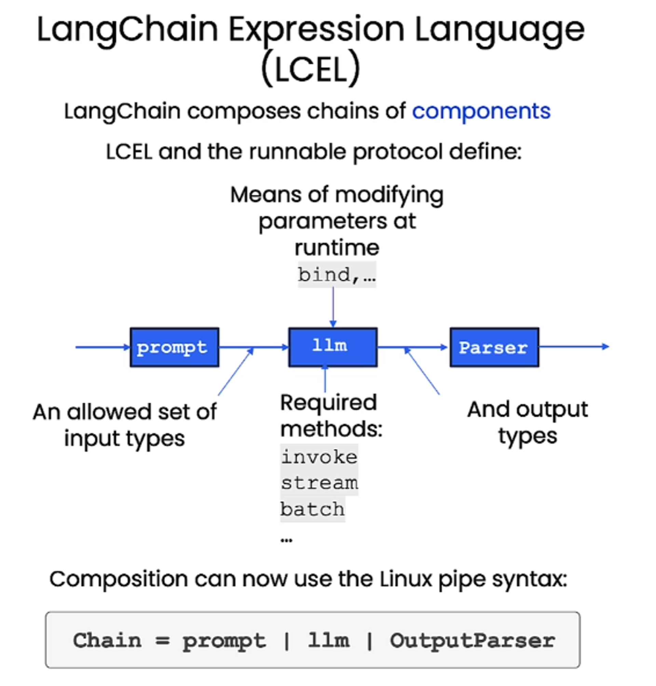

# About
deeplearning.ai course:  
https://learn.deeplearning.ai/courses/functions-tools-agents-langchain/lesson/1/introduction  

----
# OpenAI Function calling
We can use OpenAI LLM models for functions routing, by providing function descriptions and parameters in the way specified by OpenAI.  
- It just tells us what function to call and arguments to provide.  
- If the message doesnt need any function call or there isnt any appropriate function to call, normal LLM response is given. We can force a default function call in such cases. We can also force to call no function at all.
- function definition and description uses LLM tokens.

Syntax to provide function:
```json
functions = [
	{
		"name": "function_name",
		"description": "Function description, LLM checks this to determine function routing",
		"parameters": {
			"type": "type of properties, typically dictionary",
			"properties": {
				"property1": {
					"type": "property type",
					"description": "property description",
				},
				"property2": {
					// another property
					.
				},
			}
			"required": ["necessary property for function",...]
		}
	},
	{
		// another function
	},
]
```

----
# LangChain Expression Language(LCEL)

Runnable protocol that defines:
- allowed set of inputs to LangChain components
- allowed set of outputs from LangChain components
- required methods to be exposed by LangChain components
- it also provides means of modifying parameters at runtime



Runtimes support:
-  Async, batch and streaming support.
	- The methods exposed have both async and non-async counterparts.
- Fallbacks
- Parallelism
- Logging is built in

## Syntax
Simple chain:
```python
chain = prompt | model | output_parser
chain.invoke({"var":"val", "var2":"val2",...})
```

Processing the data and providing to the chain:
```python
chain = <some schema.runnable> | prompt | model | output_parser
```

## Binding own tools
```python
model = ChatOpenAI(temperature=0.1).bind(functions=functions)
runnable = prompt | functions
runnable.invoke({"input": "some sentence that needs to use given function"})
```
Here ChatOpenAI sees that we need to call a function provided in `functions` parameter, thus it responds with function name, arguments to provide etc(It does not execute the function).  

## Fallbacks
- to individual components
- to entire sequences
```python
final_chain = simple_chain.with_fallbacks([handle_chain, ...])
final_chain.invoke({})
```
If `simple_chain` is not able to handle the request and generates some error, then `handle_chain` is called and its output is given as response.  


## Parallelism with batch
```python
chain.batch([{},{},{},...])
```

## Streaming
```python
chain.stream({}) 
# returns iterable
```

## Asynchronous methods
All exposed methods have asynchronous counterparts. e.g.,
```python
chain.ainvoke({})
```

----
