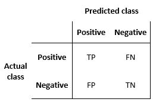
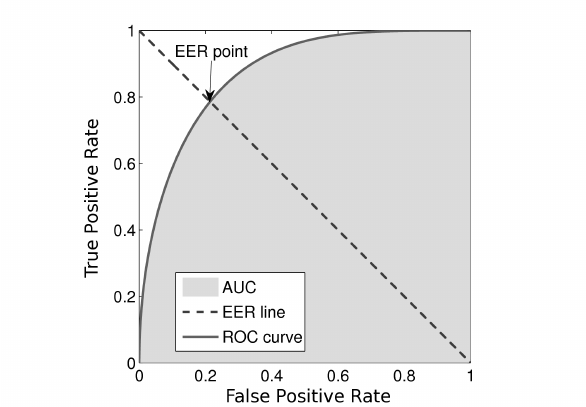

----
# Accuracy wont work

> $\large Accuracy = \frac{\text{Number of correct predictions}}{\text{Total number of predictions}}$

### If classes are imbalanced it misleads.

Say, Total number of datapoints = 100,  
99 belongs to class A & 1 belongs to class B.  
Suppose our model just outputs class A regardless of input.  
Then accuracy of our model = $\large \frac{99}{100}=99\%$.

### Even if classes are balanced we miss informations.

----
# Confusion Matrix
Positive/Negative denotes that the datapoint  belongs/'does not belong' to that class.  
$TP=$ True Positive = The datapoint Truly belongs to that class.  
$FP=$ False Positive = The datapoint was predicted to be belonging to that class, but its not.   
$TN=$ True Negative = The datapoint Truly does not belong to that class.  
$FN=$ False Negative = The datapoint was predicted to be not belonging to that class, but it actually does.



> $\large Precision = \frac{TP}{TP+FP}$  

 Of all that it has predicted as true, how many are actually True?  
  How precise is it in its predictions?  
  High value $\implies$ It is highly precise $\implies$ If it says its True Positive, then its most likely is.

> **Only precision is not enough.**  

If model does one correct TP prediction and predicts all others as Negatives(irrespective of True label.)  
$\large Precision = \frac{1}{1+0}=1$


> $Recall = Sensitivity = True\ Positive\ Rate = \large \frac{TP}{TP+FN}$  

Of all that are truly positive, how many could it identify as positive?  
 How sensitive is it to positives?  
 Highly value $\implies$ highly sensitive $\implies$ It catches almost all True Positives.

> **Only recall is also not enough.**


> F1 Score (Harmonic Mean) = $\LARGE \frac{2}{ \frac{1}{Precision} + \frac{1}{Recall}} = \frac{2 \times Precision \times Recall}{Precision + Recall}$  
> It is high when both Precision and Recall is high.

## Precision Recall trade-off
> It is possible to gain both $Precision=1=Recall$, this would mean our model is godly with no FP or FN.  

In practice typically such godly models are only those that over-fit the data.  

Typically a model will give probabilistic value in range $[0.0,1.0]$ where value $0$ means  $Negative$ and $1$ means $Positive$. But for values in between we need:
> Threshold: A value such that
```math
Prediction = \begin{cases} 
Positive & \text{model value $\ge$ threshold} \\
Negative & \text{model value $\lt$ threshold}
\end{cases}
```

Thus,
- If we increase the $threshold$ then
	- we mean take only those values which are really close to 1.
	- increases FN and TN while decreases TP and FP.
	- classifies more items as Negative, less items as Positive.
- If we decrease the $threshold$ then
	- we mean take only those values which are really close to 0.
	- increases FP and TP, but decreases TN and FN.
	- classifies less items as Negative, more items as Positive.

$\therefore FN \propto \frac{1}{FP}$  
$\because Precision \propto \frac{1}{FP}$ and $Recall \propto \frac{1}{FN}$   
$\implies Precision \propto \frac{1}{Recall}$  

Q. So if we remove the threshold system, instead build a neural network with two output neurons, one denoting probability of datapoint belonging to Positive and another to Negative. Whichever is higher we take it as prediction. Does Precision-Recall tradeoff exist here?  
chatGPT says: Yes it can occur.
"To see why, consider the case where the two classes are imbalanced, meaning that one class has many more samples than the other. In this scenario, the model may learn to prioritise accuracy on the dominant class at the expense of the minority class. As a result, the precision and recall of the model on the minority class may be lower than on the dominant class.

In other words, even though the model may have high precision and recall on the dominant class, it may have low precision and recall on the minority class. This imbalance can lead to a precision-recall tradeoff, where increasing precision on the minority class may require sacrificing recall, or vice versa.

The precision-recall tradeoff can also occur if the two classes are highly overlapping or if the decision boundary between the two classes is not well defined. In this case, increasing precision may require a decrease in recall, or vice versa, depending on the specific characteristics of the data."

----
# ROC Curve
**ROC: Receiver Operating Characteristics** - Its a graph of True Positive Rate vs False Positive Rate, showing the performance of classification model **at all classification threshold**.

The name originated from signal detection theory, where it was used to analyse ability of a receiver operator to correctly identify signals against background noise.

> $\large TPR = True\ Positive\ Rate = \frac{TP}{TP+FN} = Recall$  
> How much of the Positive class was accurately predicted as Positive?


> $\large FPR = False\ Positive\ Rate = \frac{FP}{FP+TN}$  
> How much of the Negative class was inaccurately predicted as Positive?

We want more of TPR and less of FPR $\implies$ want Top-Left corner.  


Four Corners of ROC graph:
1. Top-Left = Model predicts correctly $100\%$ of times.
2. Top-Right = Model predicts everything as Positive.
3. Bottom-Right = Model predicts wrong $100\%$ of times.
4. Bottom-Left = Model predicts everything as Negative

----
# AUC: Area Under the ROC Curve

Measures the entire 2D area under ROC curve.


| | ROC | AUC:ROC |
|-|---|---|
|Definition: | The TPR vs FPR curve. | The **Area** under ROC curve. |
|Type: | It shows the TPR vs FPR value for different threshold value chosen. | It is a scalar value (area). |
| Threshold: | Uses. | It is independent of threshold value chosen(It considers for all possible values). |
| Info: | It shows models performance for each value of threshold. | It shows model's overall ability. |
| Comparision: | Allows easy comparision of performance of same model for different threshold value. | Allows easy comparision of different models. |

----
# Multiclass Classification

## One-vs-All
Take each class against the rest of the classes.

## One-vs-One
Take each class against each other class.
