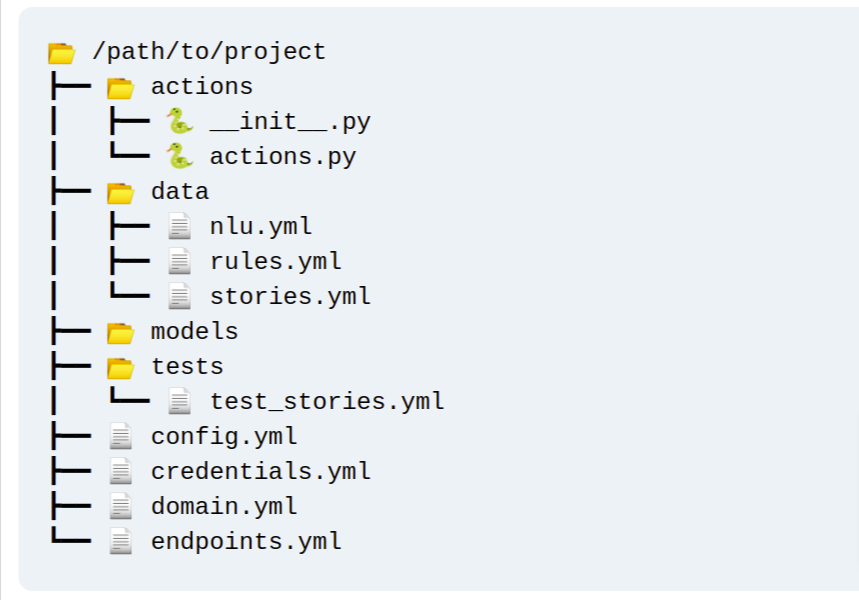

Initiate:
```
python -m rasa init
```

## File structure


- `domain.yml` everything comes together.
- `config.yml` for machine learning models.
- `data` to train assistant.
- `nlu.yml` examples of intents and entities.
- `stories.yml` examples of conversational turns.
- `rules.yml` predefined rules for dialogue policies.

## Commands

| Command | Use |
|--|--|
| `rasa init` | Start new Rasa project. |
| `rasa train` | Train new assistant based  upon current training data. |
| `rasa shell` | Chat with trained assistant. |
| `rasa -h` | Help. |
| `rasa --debug` | Extra log output when running commands. |

