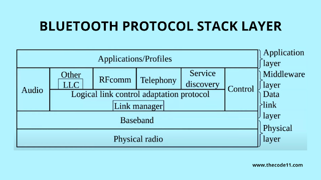

- IEEE 802.15.1
- short-wavelength UHF radio waves in ISM(Industrial Scientific and Medical) radio bands 2.4GHz-2.5GHz
- specified by an industry consortium - Bluetooth Special Interest Group

## Network architecture:
Piconet
- master (only 1) and slave (max 7) model.
- communication between master-slave only. Slave-slave communication is not present.
- slave can be parked: set to an inactive, low-power state

Scatternet:
- Collection of piconets
- A node can be slave in one piconet and master in another.

# Physical level
Binary bits transmission:
wavelength range: 120.7 mm - 124.9mm :  2.4835GHz - 2.4GHz  
The range is broken into 79 different channels. Each channel having own designated 0 and 1.  
Techniques used for signal transmission:
- **Frequency-Shift Keying/Frequency modulation:** Periodically shifting frequency of the carrier between discrete frequencies. For 1 and 0 binary bits.  
- **Frequency-Hopping Spread Spectrum:** The transmission is done in packets(of binaries) and hopped from channel to channel at 1600 Hops/sec, 625ms time slots.  
- **Phase shift keying:** Conveying data by modulating the phase of constant frequency carrier wave. Specifically DQPSK (Differential Quadratic Phase Shift Keying or pi/4) is used.  
- Alternative transmission is used for duplex communication.

Other industrial devices also share same range e.g., microwave, 2.4GHz wifi.  
 

Information Packet:
1. Access code
2. Header
3. Payload
# Software level

## Protocol Stack
Basic configuration - Piconet(master slave) and scatternet(collection of piconet).  

1. **Applications/Profiles:** Interacts with application
2. **Middleware:** 
	1. **RF Comm Layer:** Radio Frontend Component, provides serial interface with WPA and OBEX (Object Exchange).
	2. **TCS:** Telephony Control Protocol. voice services, etc.
	3. **SDP:** Service Discovery Protocol.
3. **Logical link control adaptation protocol:** Interface between upper layers and lower layers of stack. Packages data, performs segmentation and multiplexing.
4. **Link Manager:** Performs management of already established link. Also authentication and encryption.
5. **Baseband:** Performs connection establishment within a piconet.
6. **Physical Radio:** performs modulation and demodulation of data to radio Frequency signals.
